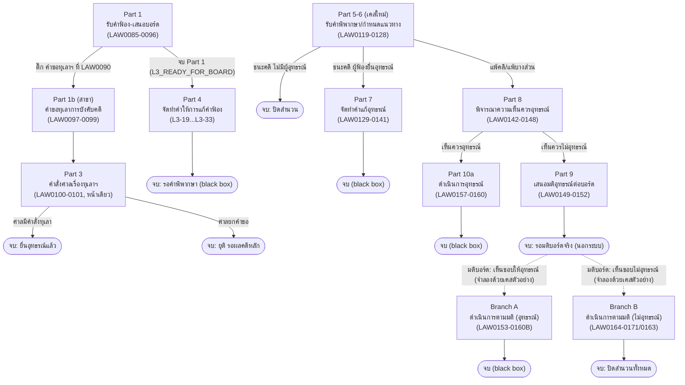

# คู่มือทดสอบ Flow ทั้งหมด — กิจกรรมที่ 10.3 (คดีศาลปกครอง)

> **Testing Guide (คู่มือสำหรับผู้ทดสอบ)** — เอกสารนี้รวบรวมทุก Part ที่ implement แล้วในกิจกรรมที่ 10.3
> ระบุหน้า (page), บทบาทที่ต้อง login (role), และ username สำหรับ login แต่ละขั้นตอน
> เพื่อให้ผู้ทดสอบไล่ตาม flow ได้ครบโดยไม่หลง
>
> อัปเดตล่าสุด: 2026-09-16 (หลังแก้ไขบทบาท LAW0098 และรวม Part 3 เป็นหน้าเดียว)
> ข้อมูลทั้งหมดดึงจาก `assets/ecmis-10-3.js` และ `assets/ecmis-activity10.js` ตรงๆ (ไม่ใช่เอกสารแผนที่อาจไม่ตรงกับโค้ดจริง)

---

## 0. วิธีใช้คู่มือนี้ (How to use)

1. เปิด `login.html` แล้วเลือกบทบาท (role) ตาม username ในตารางแต่ละ Part ด้านล่าง
2. เข้า `01-work-inbox.html` (หน้ารวมงาน) → กรองหมวด "คดีศาลปกครอง" (10.3) → คลิกเคสตัวอย่าง (sample case) ที่ระบุไว้
3. ทำตามขั้นตอนในหน้านั้น (กรอกฟอร์ม/แนบไฟล์/ลงนาม) แล้วกด submit
4. ระบบจะพากลับมาที่ inbox — เคสจะขยับไปสถานะถัดไปเอง (บทบาทถัดไปจะเห็นเคสนี้ค้างงานให้ทำต่อ)
5. **สลับบทบาท** = ออกจากระบบ (โปรไฟล์มุมขวาบน → ออกจากระบบ) แล้ว login ใหม่ด้วย username ของบทบาทถัดไป

**สัญลักษณ์ที่ใช้ในเอกสารนี้:**
- 🔹 = จุดเริ่มต้น (Entry point / Trigger) — วิธีที่เคสเข้าสู่ Part นี้
- 🔸 = จุดแยกทาง (Branch / Decision) — เลือกได้มากกว่า 1 ทาง
- ⏹️ = จุดจบ (Terminal) — เคสหยุดที่นี่ ไม่มีหน้าให้ทำต่อ (บางจุดรอผลจริงนอกระบบ)
- ✅ = มีเคสตัวอย่าง (sample case) พร้อมทดสอบทันที ไม่ต้องสร้างเคสใหม่

---

## 1. ตาราง Login — บทบาททั้งหมดที่ใช้ในกิจกรรมที่ 10.3

| Role ID | Username (login) | ชื่อ | ตำแหน่ง (Title) |
|---|---|---|---|
| `admin_legal` | `Kanda.R` | นางกานดา รักษ์ธรรม | เจ้าหน้าที่ธุรการกองกฎหมาย |
| `dir_legal` | `Napas.S` | นายนภัส สอนดี | ผู้อำนวยการกองกฎหมาย |
| `case_group_director` | `Pichai.R` | นายพิชัย เรืองศรี | ผู้อำนวยการกลุ่มงานคดี |
| `case_legal_officer` | `Kittisak.S` | นายกิตติศักดิ์ แสงทอง | นิติกร กลุ่มงานคดี |
| `chairman` | `Wichai.Y` | นายวิชัย ยุติธรรม | ประธานกรรมการ ป.ป.ท. |
| `secgen` | `Apichat.S` | นายอภิชาติ สุจริตกุล | เลขาธิการ คณะกรรมการ ป.ป.ท. |
| `deputy_sg` | `Surapong.W` | นายสุรพงษ์ วัฒนา | รองเลขาธิการ ป.ป.ท. (ปฏิบัติราชการแทน) |
| `registry` | `Anucha.S` | นายอนุชา สารบรรณ | สารบรรณกลาง |

---

## 2. Part 1 — รับคำฟ้อง ถึง สรุปความเห็นเสนอบอร์ด (LAW0085-0096)

🔹 **จุดเริ่มต้น:** ธุรการกองกฎหมาย (`admin_legal`) สร้างเคสใหม่ที่ `02-board-intake.html` เลือกหมวด "คดีศาลปกครอง" (10.3)

| ลำดับ | Code | หน้า (Page) | บทบาท (Login) | ทำอะไร |
|---|---|---|---|---|
| 1 | LAW0085 | `02-board-intake.html` | ธุรการ (`Kanda.R`) | รับเรื่อง กรอกข้อมูลคดี เสนอ ผอ.กองกฎหมาย |
| 2 | LAW0088 | `10-3-02-legal-director-assign.html` | ผอ.กองกฎหมาย (`Napas.S`) | ลงนามมอบหมาย |
| 3 | LAW0089 | `10-3-03-group-director-assign.html` | ผอ.กลุ่มงานคดี (`Pichai.R`) | มอบหมายนิติกรผู้รับผิดชอบ |
| 4 | LAW0090 | `10-3-04-lawyer-review-complaint.html` | นิติกร (`Kittisak.S`) | ตรวจสอบคำฟ้อง + จัดทำบันทึกความเห็น (🔹 ติ๊ก checkbox ตรงนี้เพื่อแตกสาขา Part 1b — ดูข้อ 3) |
| 5 | LAW0093 | `10-3-07-group-director-approve.html` | ผอ.กลุ่มงานคดี (`Pichai.R`) | พิจารณาและเห็นชอบ |
| 6 | LAW0094 | `10-3-08-legal-director-sign.html` | ผอ.กองกฎหมาย (`Napas.S`) | ตรวจสอบและลงนามผ่านเรื่อง |
| 7 | LAW0095 | `10-3-09-legal-admin-dispatch.html` | ธุรการ (`Kanda.R`) | ออกเลขส่งภายในและส่งมติเสนอบอร์ด → ⏹️ จบ Part 1 (สถานะ `L3_READY_FOR_BOARD`) → เดินต่ออัตโนมัติเข้า **Part 4** (ข้อ 5) |

**✅ เคสตัวอย่างพร้อมทดสอบ:**
| เคส | สถานะปัจจุบัน | ล็อกอินขั้นถัดไปด้วย |
|---|---|---|
| `คดีปกครอง-100097/2569` | รอ LAW0090 (นิติกรตรวจสอบ) | นิติกร (`Kittisak.S`) |
| `คดีปกครอง-100098/2569` | รอ LAW0093 (ผอ.กลุ่มงานเห็นชอบ) | ผอ.กลุ่มงานคดี (`Pichai.R`) |
| `คดีปกครอง-100100/2569` | รอ LAW0090 | นิติกร (`Kittisak.S`) |
| `คดีปกครอง-100099/2569`, `100401/2569`, `100402/2569` | จบ Part 1 แล้ว (`L3_READY_FOR_BOARD`) พร้อมเข้า Part 4 | ธุรการ (`Kanda.R`) |

---

## 3. Part 1b — สาขาคู่ขนาน: คำขอทุเลาการบังคับคดี (LAW0097-0099)

🔹 **จุดเริ่มต้น:** ที่ `10-3-04-lawyer-review-complaint.html` (LAW0090 ของ Part 1) นิติกรติ๊ก checkbox
**"ผู้ฟ้องคดียื่นคำขอทุเลาการบังคับคดีมาด้วย"** แล้ว submit → ระบบสร้าง **เคสลูกแยกต่างหาก**
(เลขคดีเดิม + `-B` เช่น `100097/2569` → `100097-B/2569`) เดินสถานะขนานไปกับเคสแม่ ไม่กระทบกัน

| ลำดับ | Code | หน้า (Page) | บทบาท (Login) | ทำอะไร |
|---|---|---|---|---|
| 1 | LAW0097 | `10-3b-01-lawyer-draft-stay-objection.html` | นิติกร (`Kittisak.S`) | แนบคำชี้แจงคัดค้านคำขอทุเลาฯ (ไฟล์บังคับ) + เอกสารประกอบ (ถ้ามี) + เลือก/แก้ไขศาลที่ยื่น |
| 2 | LAW0098 | `10-3b-02-chairman-sign-stay-objection.html` | **ประธานกรรมการ ป.ป.ท.** (`Wichai.Y`) | ตรวจสอบเอกสารที่นิติกรแนบ แล้วลงนาม (**ไม่ใช่ธุรการ** — แก้ไขจากแผนเดิมให้ตรงผัง AS-IS) |
| 3 | LAW0099 | `10-3b-03-lawyer-dispatch-stay-objection.html` | นิติกร (`Kittisak.S`) | เลือกวิธีจัดส่ง + แนบสำเนาหนังสือนำส่งศาล + ลงนาม + ปิดสำนวน Part 1b → ⏹️ จบ (สถานะ `L3B_CLOSED`) → เดินต่ออัตโนมัติเข้า **Part 3** (ข้อ 4) |

**✅ เคสตัวอย่างพร้อมทดสอบ (ทั้งหมดเป็นเคสลูก `-B/2569`):**
| เคส | สถานะปัจจุบัน | ล็อกอินขั้นถัดไปด้วย |
|---|---|---|
| `คดีปกครอง-100097-B/2569` | รอ LAW0097 (นิติกรแนบเอกสาร) | นิติกร (`Kittisak.S`) |
| `คดีปกครอง-100098-B/2569` | รอ LAW0097 | นิติกร (`Kittisak.S`) |
| `คดีปกครอง-100099-B/2569` | รอ LAW0097 | นิติกร (`Kittisak.S`) |
| `คดีปกครอง-100100-B/2569` | จบ Part 1b แล้ว (`L3B_CLOSED`) พร้อมเข้า Part 3 | นิติกร (`Kittisak.S`) |

> 💡 ในหน้า `01-work-inbox.html` เคสลูกจะแสดง **เยื้อง/จัดกลุ่ม** ต่อจากเคสแม่ทันทีในตาราง (ไม่ใช่กระจายไปตามลำดับปกติ) เพื่อให้เห็นว่าเป็นคู่กัน

---

## 4. Part 3 — คำสั่งศาลเรื่องทุเลาการบังคับคดี (LAW0100-0102)

🔹 **จุดเริ่มต้น:** อัตโนมัติทันทีที่เคสลูกจบ Part 1b (สถานะ `L3B_CLOSED`) — **ไม่มีขั้นธุรการคั่นกลาง**
(ผังจริงระบุ LAW0100 เป็นของ "ศาลปกครอง" ไม่ใช่ธุรการ จึงเป็นนิติกรที่บันทึกผลคำสั่งศาลต่อเนื่องไปเลย)

รวม LAW0100 (รับคำสั่ง+จำแนกทาง) และ LAW0101 (ทำคำอุทธรณ์) เป็น **หน้าเดียว**

| Code | หน้า (Page) | บทบาท (Login) | ทำอะไร |
|---|---|---|---|
| LAW0100 + LAW0101 | `10-3b-04-lawyer-court-order-intake.html` | นิติกร (`Kittisak.S`) | ระบุเลขที่/วันที่คำสั่งศาล + แนบคำวินิจฉัย/คำสั่งศาล แล้วเลือกผล 1 ใน 2 ทาง (🔸 ดูด้านล่าง) |

🔸 **จุดแยกทาง (เลือกในหน้าเดียวกัน ไม่ต้องเปลี่ยนหน้า):**

| เลือก | สถานะที่เขียน | ต้องทำอะไรเพิ่ม | จบที่ |
|---|---|---|---|
| **ศาลมีคำสั่งให้ทุเลาการบังคับคดี** | `L3B2_APPEAL_FILED` | ช่องแนบ **"หนังสืออุทธรณ์คัดค้านคำสั่งศาล"** (ไฟล์บังคับ) จะโผล่ขึ้นทันที + ต้อง**ลงนาม** ก่อน submit | ⏹️ จบ (LAW0101 — ทำคำอุทธรณ์แล้ว) |
| **ศาลยกคำขอทุเลาการบังคับคดี** | `L3B2_CLOSED` | ไม่ต้องแนบเพิ่ม ไม่ต้องลงนาม กด submit ได้เลย | ⏹️ จบ (LAW0102 — ยุติคำขอทุเลา รอผลคดีหลัก) |

**✅ เคสตัวอย่างพร้อมทดสอบ:**
| เคส | สถานะปัจจุบัน | ล็อกอินด้วย |
|---|---|---|
| `คดีปกครอง-100100-B/2569` | รอ LAW0100+LAW0101 (`L3B_CLOSED`) | นิติกร (`Kittisak.S`) |

---

## 5. Part 4 — จัดทำคำให้การแก้คำฟ้อง (L3-19 ถึง L3-33)

🔹 **จุดเริ่มต้น:** อัตโนมัติทันทีที่เคสหลักจบ Part 1 (สถานะ `L3_READY_FOR_BOARD`) — เดินต่อบนเคสเดิม ไม่สร้างเคสใหม่

| ลำดับ | Code | หน้า (Page) | บทบาท (Login) | ทำอะไร |
|---|---|---|---|---|
| 1 | L3-19 | `10-3-10-legal-admin-resolution-notice.html` | ธุรการ (`Kanda.R`) | รับเรื่อง แจ้งผลมติคณะกรรมการ ป.ป.ท. |
| 2 | L3-20 | `10-3-11-legal-director-assign-resolution.html` | ผอ.กองกฎหมาย (`Napas.S`) | พิจารณาผลมติและมอบหมายงาน |
| 3 | L3-21 | `10-3-12-group-director-approve-resolution.html` | ผอ.กลุ่มงานคดี (`Pichai.R`) | พิจารณาและเห็นชอบผลมติ/ข้อสั่งการ |
| 4 | L3-22 | `10-3-13-lawyer-request-extension.html` | นิติกร (`Kittisak.S`) | ยื่นคำขอขยายเวลาต่อศาล + ร่างคำให้การแก้คำฟ้อง |
| 5 | L3-24 | `10-3-15-group-director-review-answer.html` | ผอ.กลุ่มงานคดี (`Pichai.R`) | ตรวจสอบร่างคำให้การ |
| 6 | L3-25 | `10-3-16-legal-director-review-answer.html` | ผอ.กองกฎหมาย (`Napas.S`) | ตรวจสอบร่างคำให้การแก้คำฟ้อง |
| 7 | L3-26 | `10-3-17-legal-admin-internal-dispatch-answer.html` | ธุรการ (`Kanda.R`) | ออกเลขหนังสือส่งภายใน + เลือกผู้ลงนาม (เลขาธิการ/รองเลขาธิการ) |
| 8a | L3-27A | `10-3-18-secgen-sign-cover-letter.html` | เลขาธิการ ป.ป.ท. (`Apichat.S`) | ตรวจคำให้การและลงนามหนังสือนำส่ง (ถ้าเลือกเลขาธิการที่ข้อ 7) |
| 8b | L3-27B | `10-3-19-deputy-sg-sign-cover-letter.html` | รองเลขาธิการ ป.ป.ท. (`Surapong.W`) | ตรวจคำให้การและลงนามหนังสือนำส่ง (ถ้าเลือกรองเลขาธิการที่ข้อ 7) |
| 9 | L3-28 | `10-3-20-registry-issue-external-no.html` | สารบรรณกลาง (`Anucha.S`) | ออกเลขหนังสือส่งออก |
| 10 | L3-29 | `10-3-21-chairman-sign-answer.html` | **ประธานกรรมการ ป.ป.ท.** (`Wichai.Y`) | ลงนามในคำให้การแก้คำฟ้อง (ในฐานะผู้แทนผู้ถูกฟ้องคดี) |
| 11 | L3-30 | `10-3-22-legal-admin-collect-originals.html` | ธุรการ (`Kanda.R`) | รวบรวมเอกสารฉบับจริงที่ลงนามครบถ้วนแล้ว |
| 12 | L3-31 | `10-3-23-lawyer-collect-documents.html` | นิติกร (`Kittisak.S`) | ตรวจสอบและเรียงเอกสารก่อนส่ง |
| 13 | L3-32 | `10-3-24-lawyer-post-to-prosecutor.html` | นิติกร (`Kittisak.S`) | จัดส่งทางไปรษณีย์ไปยังสำนักงานคดีปกครอง (อัยการ) |
| 14 | L3-33 | `10-3-25-lawyer-track-status.html` | นิติกร (`Kittisak.S`) | ติดตามสถานะการจัดส่งและใบตอบรับ → ⏹️ จบ Part 4 (สถานะ `L3_AWAITING_JUDGMENT` — รอผลคำพิพากษาจากศาล เป็น black box) |

**✅ เคสตัวอย่างพร้อมทดสอบ (ทุกเคสอยู่จุดเริ่ม Part 4):**
`คดีปกครอง-100099/2569`, `คดีปกครอง-100401/2569`, `คดีปกครอง-100402/2569` — ล็อกอิน ธุรการ (`Kanda.R`)

---

## 6. Part 5-6 — รับคำพิพากษาศาลปกครองชั้นต้น + วิเคราะห์ผล/กำหนดแนวทาง (LAW0119-0128)

🔹 **จุดเริ่มต้น:** **เคสใหม่แยกต่างหาก** (ไม่ใช่เคสต่อจาก Part 1-4) — ธุรการสร้างที่ `10-3v-00-legal-admin-verdict-intake.html`
โดยตรง (จำลองว่าได้รับหนังสือแจ้งผลคำพิพากษาจากศาลแล้ว) มี `l3CaseType: "verdict"` กำกับ

| ลำดับ | Code | หน้า (Page) | บทบาท (Login) | ทำอะไร |
|---|---|---|---|---|
| 1 | LAW0119+0120 | `10-3v-00-legal-admin-verdict-intake.html` | ธุรการ (`Kanda.R`) | รับหนังสือแจ้งผลคำพิพากษา + ลงทะเบียนคดีปกครอง (รวม 2 ขั้นเป็นหน้าเดียว) |
| 2 | LAW0121 | `10-3v-02-legal-director-assign.html` | ผอ.กองกฎหมาย (`Napas.S`) | แจกจ่าย/มอบหมาย |
| 3 | LAW0122 | `10-3v-03-group-director-assign.html` | ผอ.กลุ่มงานคดี (`Pichai.R`) | มอบหมายนิติกร |
| 4 | LAW0123 | `10-3v-04-lawyer-verdict-analysis.html` | นิติกร (`Kittisak.S`) | ตรวจ/วิเคราะห์ผลคำพิพากษา เสนอแนวทาง |
| 5 | LAW0126 | `10-3v-05-group-director-approve.html` | ผอ.กลุ่มงานคดี (`Pichai.R`) | พิจารณาและเห็นชอบ |
| 6 | LAW0127 | `10-3v-06-legal-director-decide.html` | ผอ.กองกฎหมาย (`Napas.S`) | ลงนามกำหนดแนวทางดำเนินการ — 🔸 เลือก 1 ใน 3 ทาง (ดูตารางด้านล่าง) |

🔸 **จุดแยกทาง (LAW0128 — เลือกที่ `10-3v-06`):**

| เลือก | ความหมาย | สถานะที่เขียน | ไปต่อที่ |
|---|---|---|---|
| ชนะคดี (ผู้ฟ้องยื่นอุทธรณ์) | `APPEAL_REPLY` | `L3V_TO_APPEAL_REPLY` | **Part 7** (ข้อ 7) |
| แพ้คดี / แพ้บางส่วน | `APPEAL_CONSIDER` | `L3V_TO_APPEAL_CONSIDER` | **Part 8** (ข้อ 8) |
| ชนะคดี (ไม่มีผู้ยื่นอุทธรณ์) | `CLOSE` | `L3V_TO_CLOSE` | จบทันทีที่ `10-3v-07-lawyer-close-case.html` (นิติกร, LAW0163 — ⏹️ ปิดสำนวน) |

**✅ เคสตัวอย่างพร้อมทดสอบ:**
| เคส | สถานะปัจจุบัน | ล็อกอินขั้นถัดไปด้วย |
|---|---|---|
| `100301/2569` | รอ LAW0121 | ผอ.กองกฎหมาย (`Napas.S`) |
| `100302/2569` | รอ LAW0122 | ผอ.กลุ่มงานคดี (`Pichai.R`) |
| `100303/2569` | รอ LAW0123 | นิติกร (`Kittisak.S`) |
| `100304/2569` | รอ LAW0126 | ผอ.กลุ่มงานคดี (`Pichai.R`) |
| `100305/2569` | รอ LAW0127 (เลือกแนวทาง) | ผอ.กองกฎหมาย (`Napas.S`) |
| `100306/2569` | เลือกทาง CLOSE แล้ว รอปิดสำนวน | นิติกร (`Kittisak.S`) ที่ `10-3v-07` |
| `100307/2569` | เลือกทาง APPEAL_REPLY แล้ว พร้อมเข้า Part 7 | ธุรการ (`Kanda.R`) |
| `100308/2569` | เลือกทาง APPEAL_CONSIDER แล้ว พร้อมเข้า Part 8 | ธุรการ (`Kanda.R`) |

> ⚠️ **หมายเหตุ (ทราบแล้ว ไม่ต้องแจ้งเป็นบั๊ก):** `100307/2569` มีข้อมูลซ้ำ 2 รายการในไฟล์ seed (เลข id ซ้ำกัน) — มี background task ถูกตั้งไว้ให้แก้แล้วแยกต่างหาก

---

## 7. Part 7 — จัดทำคำแก้อุทธรณ์ (LAW0129-0141) — สาย "ชนะคดี ผู้ฟ้องยื่นอุทธรณ์"

🔹 **จุดเริ่มต้น:** อัตโนมัติจาก Part 6 เมื่อเลือกทาง `APPEAL_REPLY` (สถานะ `L3V_TO_APPEAL_REPLY`)

| ลำดับ | Code | หน้า (Page) | บทบาท (Login) | ทำอะไร |
|---|---|---|---|---|
| 1 | LAW0131 | `10-3v-08-legal-admin-appeal-intake.html` | ธุรการ (`Kanda.R`) | รับหนังสือแจ้งคำสั่งศาลให้ทำคำแก้อุทธรณ์ |
| 2 | LAW0135 | `10-3v-09-legal-director-assign.html` | ผอ.กองกฎหมาย (`Napas.S`) | แจกจ่าย/มอบหมาย |
| 3 | L7ASSIGN | `10-3v-10-group-director-assign.html` | ผอ.กลุ่มงานคดี (`Pichai.R`) | มอบหมายนิติกร |
| 4 | LAW0133 | `10-3v-11-lawyer-draft-appeal-reply.html` | นิติกร (`Kittisak.S`) | ลงทะเบียนคดี/ตรวจสอบ/ร่างคำแก้อุทธรณ์ |
| 5 | LAW0134 | `10-3v-12-group-director-approve.html` | ผอ.กลุ่มงานคดี (`Pichai.R`) | ตรวจร่างคำแก้อุทธรณ์และเห็นชอบ |
| 6 | LAW0139 | `10-3v-13-legal-director-sign.html` | ผอ.กองกฎหมาย (`Napas.S`) | พิจารณาและลงนามในคำแก้อุทธรณ์ |
| 7 | LAW0140 | `10-3v-14-legal-admin-dispatch.html` | ธุรการ (`Kanda.R`) | ออกเลขหนังสือส่งภายนอก |
| 8 | LAW0141 | `10-3v-15-lawyer-send-appeal-reply.html` | นิติกร (`Kittisak.S`) | ส่งหนังสือและคำแก้อุทธรณ์ไปสำนักงานคดีปกครอง → ⏹️ จบ Part 7 (`L7_SENT_TO_PROSECUTOR` — black box รอผลจากศาล) |

**✅ เคสตัวอย่างพร้อมทดสอบ:** `คดีปกครอง-100307/2569` — ล็อกอิน ธุรการ (`Kanda.R`)

---

## 8. Part 8 — พิจารณาความเห็นควรอุทธรณ์ (LAW0142-0148) — สาย "แพ้คดี"

🔹 **จุดเริ่มต้น:** อัตโนมัติจาก Part 6 เมื่อเลือกทาง `APPEAL_CONSIDER` (สถานะ `L3V_TO_APPEAL_CONSIDER`)

| ลำดับ | Code | หน้า (Page) | บทบาท (Login) | ทำอะไร |
|---|---|---|---|---|
| 1 | LAW0143 | `10-3v-16-legal-admin-appeal-consider-intake.html` | ธุรการ (`Kanda.R`) | รับหนังสือแจ้งผลคำพิพากษาเพื่อพิจารณาอุทธรณ์ |
| 2 | L8ASSIGN1 | `10-3v-17-legal-director-assign1.html` | ผอ.กองกฎหมาย (`Napas.S`) | มอบหมาย ผอ.กลุ่มงานคดี (ลงทะเบียนคดี) |
| 3 | L8GROUPASSIGN1 | `10-3v-18-group-director-assign1.html` | ผอ.กลุ่มงานคดี (`Pichai.R`) | มอบหมายนิติกร (ลงทะเบียนคดี) |
| 4 | LAW0145 | `10-3v-19-lawyer-register.html` | นิติกร (`Kittisak.S`) | ลงทะเบียนคดี/ตรวจสอบคำพิพากษา/เสนอความเห็นควรอุทธรณ์หรือไม่ |
| 5 | LAW0146 | `10-3v-20-group-director-approve1.html` | ผอ.กลุ่มงานคดี (`Pichai.R`) | พิจารณาและยืนยันความเห็นควรอุทธรณ์ — 🔸 เลือก 1 ใน 2 ทาง |

🔸 **จุดแยกทาง (เลือกที่ `10-3v-20`):**

| เลือก | สถานะที่เขียน | ไปต่อที่ |
|---|---|---|
| เห็นควรอุทธรณ์ | `L8_TO_APPEAL_DRAFT` | **Part 10a** (ข้อ 9) |
| เห็นควรไม่อุทธรณ์ | `L8_TO_BOARD_PROPOSE` | **Part 9** (ข้อ 10) |

**✅ เคสตัวอย่างพร้อมทดสอบ:** `คดีปกครอง-100308/2569` — ล็อกอิน ธุรการ (`Kanda.R`)

---

## 9. Part 10a — ดำเนินการอุทธรณ์ (LAW0157-0160) — สาย "เห็นควรอุทธรณ์"

🔹 **จุดเริ่มต้น:** อัตโนมัติจาก Part 8 เมื่อเลือก "เห็นควรอุทธรณ์" (สถานะ `L8_TO_APPEAL_DRAFT`)

| ลำดับ | Code | หน้า (Page) | บทบาท (Login) | ทำอะไร |
|---|---|---|---|---|
| 1 | LAW0157 | `10-3v-22-group-director-review-appeal.html` | ผอ.กลุ่มงานคดี (`Pichai.R`) | ตรวจร่างคำอุทธรณ์ |
| 2 | LAW0158 | `10-3v-23-legal-director-sign-appeal.html` | ผอ.กองกฎหมาย (`Napas.S`) | พิจารณาและลงนามคำอุทธรณ์/หนังสือถึงสำนักงานคดีปกครอง |
| 3 | LAW0159 | `10-3v-24-legal-admin-dispatch.html` | ธุรการ (`Kanda.R`) | ออกเลขหนังสือส่งภายนอก |
| 4 | LAW0160 | `10-3v-25-lawyer-send-appeal.html` | นิติกร (`Kittisak.S`) | ส่งหนังสือและคำอุทธรณ์ไปยังสำนักงานคดีปกครอง → ⏹️ จบ (`L10_SENT_TO_PROSECUTOR` — black box) |

**✅ เคสตัวอย่างพร้อมทดสอบ:** `คดีปกครอง-100309/2569` (รอ LAW0157) — ล็อกอิน ผอ.กลุ่มงานคดี (`Pichai.R`)

---

## 10. Part 9 — เสนอมติอุทธรณ์ต่อบอร์ด (LAW0149-0152) — สาย "เห็นควรไม่อุทธรณ์"

🔹 **จุดเริ่มต้น:** อัตโนมัติจาก Part 8 เมื่อเลือก "เห็นควรไม่อุทธรณ์" (สถานะ `L8_TO_BOARD_PROPOSE`)

| ลำดับ | Code | หน้า (Page) | บทบาท (Login) | ทำอะไร |
|---|---|---|---|---|
| 1 | LAW0150 | `10-3v-26-group-director-board-approve.html` | ผอ.กลุ่มงานคดี (`Pichai.R`) | พิจารณาและลงนามเห็นชอบ (เสนอมติบอร์ด) |
| 2 | LAW0151 | `10-3v-27-legal-director-board-approve.html` | ผอ.กองกฎหมาย (`Napas.S`) | พิจารณาและลงนามเห็นชอบ (เสนอมติบอร์ด) |
| 3 | LAW0152 | `10-3v-28-legal-admin-board-propose.html` | ธุรการ (`Kanda.R`) | ส่งมติเสนอบอร์ด → ⏹️ จบ (`L9_PROPOSED_TO_BOARD` — **black box: มติบอร์ดจริงเกิดนอกระบบ ไม่มีหน้าต่อ**) |

**✅ เคสตัวอย่างพร้อมทดสอบ:** `คดีปกครอง-100310/2569` (รอ LAW0150) — ล็อกอิน ผอ.กลุ่มงานคดี (`Pichai.R`)

> ⚠️ **สำคัญ:** เคสที่จบ Part 9 แล้ว (`L9_PROPOSED_TO_BOARD`) **ไม่มี route อัตโนมัติต่อ** เพราะมติบอร์ดจริงตัดสินใจนอกระบบ
> การทดสอบ Branch A/B (ข้อ 11-12) ด้านล่างจึงใช้ **เคสตัวอย่างที่ตั้งสถานะไว้ล่วงหน้าแทน** ว่า "มติบอร์ดออกมาแล้ว" — ไม่ได้เดินต่อจากเคส 100310 จริงๆ

---

## 11. Branch A — มติบอร์ดเห็นชอบให้อุทธรณ์ (LAW0153-0160B)

🔹 **จุดเริ่มต้น:** เคสตัวอย่างที่ตั้งสถานะ `L9_BOARD_APPROVED_APPEAL` ไว้ล่วงหน้า (จำลองว่ามติบอร์ดอนุมัติให้อุทธรณ์แล้ว)

| ลำดับ | Code | หน้า (Page) | บทบาท (Login) | ทำอะไร |
|---|---|---|---|---|
| 1 | (intake) | `10-3v-29-legal-admin-board-appeal-intake.html` | ธุรการ (`Kanda.R`) | รับหนังสือแจ้งมติบอร์ดเห็นชอบให้อุทธรณ์ |
| 2 | LAW0155 | `10-3v-30-legal-director-assign2.html` | ผอ.กองกฎหมาย (`Napas.S`) | พิจารณาและมอบหมายงาน |
| 3 | LAW0154 | `10-3v-31-group-director-assign2.html` | ผอ.กลุ่มงานคดี (`Pichai.R`) | พิจารณาเห็นชอบและมอบหมายนิติกรดำเนินการ |
| 4 | LAW0153+0156 | `10-3v-32-lawyer-draft-appeal2.html` | นิติกร (`Kittisak.S`) | รับเรื่องเพื่อแจ้งผล + ร่างคำอุทธรณ์ |
| 5 | LAW0157B | `10-3v-33-group-director-review-appeal2.html` | ผอ.กลุ่มงานคดี (`Pichai.R`) | ตรวจร่างคำอุทธรณ์ |
| 6 | LAW0158B | `10-3v-34-legal-director-sign-appeal2.html` | ผอ.กองกฎหมาย (`Napas.S`) | พิจารณาและลงนามคำอุทธรณ์ |
| 7 | LAW0159B | `10-3v-35-legal-admin-dispatch2.html` | ธุรการ (`Kanda.R`) | ออกเลขหนังสือส่งภายนอก |
| 8 | LAW0160B | `10-3v-36-lawyer-send-appeal2.html` | นิติกร (`Kittisak.S`) | ส่งหนังสือและคำอุทธรณ์ไปยังสำนักงานคดีปกครอง → ⏹️ จบ (`L9A_SENT_TO_PROSECUTOR`) |

**✅ เคสตัวอย่างพร้อมทดสอบ:** `คดีปกครอง-100311/2569` (รอ intake) — ล็อกอิน ธุรการ (`Kanda.R`)

---

## 12. Branch B — มติบอร์ดเห็นชอบไม่อุทธรณ์ (LAW0164-0171/0163)

🔹 **จุดเริ่มต้น:** เคสตัวอย่างที่ตั้งสถานะ `L9_BOARD_APPROVED_NO_APPEAL` ไว้ล่วงหน้า (จำลองว่ามติบอร์ดเห็นชอบไม่อุทธรณ์แล้ว)

| ลำดับ | Code | หน้า (Page) | บทบาท (Login) | ทำอะไร |
|---|---|---|---|---|
| 1 | (intake) | `10-3v-37-legal-admin-no-appeal-intake.html` | ธุรการ (`Kanda.R`) | รับหนังสือแจ้งมติบอร์ดเห็นชอบไม่อุทธรณ์ |
| 2 | (assign) | `10-3v-38-legal-director-assign3.html` | ผอ.กองกฎหมาย (`Napas.S`) | พิจารณาและมอบหมายงาน |
| 3 | (assign) | `10-3v-39-group-director-assign3.html` | ผอ.กลุ่มงานคดี (`Pichai.R`) | พิจารณาและมอบหมายนิติกรดำเนินการ |
| 4 | LAW0164+0167 | `10-3v-40-lawyer-no-appeal-intake.html` | นิติกร (`Kittisak.S`) | รับเรื่องและจัดทำหนังสือส่งภายนอกถึงอัยการ |
| 5 | LAW0168 | `10-3v-45-group-director-review3.html` | ผอ.กลุ่มงานคดี (`Pichai.R`) | ตรวจสอบหนังสือ |
| 6 | LAW0169 | `10-3v-46-legal-director-sign3.html` | ผอ.กองกฎหมาย (`Napas.S`) | ลงนามในหนังสือที่ส่งถึงอัยการ |
| 7 | LAW0170 | `10-3v-47-legal-admin-dispatch3.html` | ธุรการ (`Kanda.R`) | ออกเลขหนังสือ |
| 8 | LAW0171+0163 | `10-3v-48-lawyer-send-close.html` | นิติกร (`Kittisak.S`) | ส่งหนังสือแจ้งความประสงค์ไม่อุทธรณ์ + ลงนาม + ปิดสำนวน → ⏹️ จบ (`L9B_CLOSED` — จบขั้นตอนทั้งหมดของกิจกรรมที่ 10.3 สายนี้) |

**✅ เคสตัวอย่างพร้อมทดสอบ:** `คดีปกครอง-100312/2569` (รอ intake) — ล็อกอิน ธุรการ (`Kanda.R`)

---

## 13. สรุปแผนผัง Part ทั้งหมด (Overview Diagram)

---

## 14. ข้อจำกัดที่ทราบแล้ว (Known limitations — ไม่ต้องแจ้งเป็นบั๊ก)

| # | เรื่อง |
|---|---|
| 1 | ไฟล์แนบทุกจุดเก็บเฉพาะ **ชื่อไฟล์** (mockup ไม่มี backend เก็บไฟล์จริง) ปุ่มดาวน์โหลด/แสดงตัวอย่างเป็นการจำลอง |
| 2 | ลายเซ็น (signature) ในโหมดทดสอบเป็นภาพ mockup ไม่ใช่ลายเซ็นดิจิทัลจริง |
| 3 | เคส `คดีปกครอง-100307/2569` มีข้อมูลซ้ำ 2 รายการในไฟล์ seed data (ไม่กระทบการทดสอบ แต่ทราบแล้วว่าเป็นบั๊ก มี task แก้แยกต่างหาก) |
| 4 | จุดที่ระบุ "black box" คือปลายทางที่รอผลจริงจากภายนอกระบบ (ศาล/บอร์ด/อัยการ) — ยังไม่ implement หน้าต่อ เพราะเป็นขั้นตอนนอกกองกฎหมาย |
| 5 | ข้อมูล localStorage ของเบราว์เซอร์ผูกกับ `DATA_VERSION` ใน `assets/ecmis-activity10.js` — ถ้าเห็นข้อมูลเคสไม่ตรงกับคู่มือนี้ ให้ล้าง localStorage แล้วโหลดหน้าใหม่ (ระบบจะ seed ข้อมูลชุดล่าสุดให้อัตโนมัติ) |
