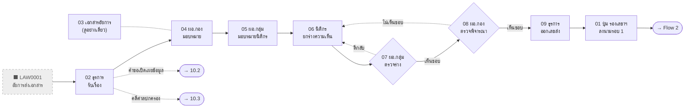
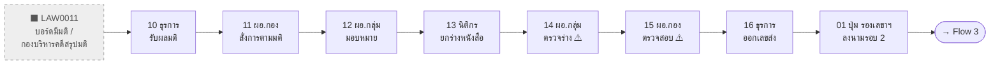
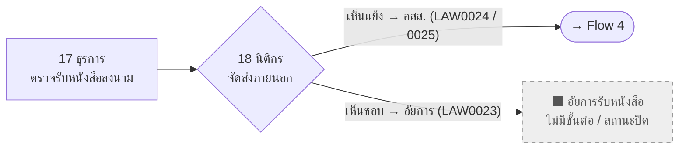
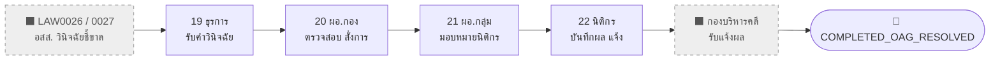

# กิจกรรมที่ 10.1 — Overall Flow (Role · Page · Step · Status · LAW)

> สร้าง: 2026-09-24 · ขอบเขต: หน้า legacy `01-*.html` … `22-*.html`
> ตำแหน่งไฟล์: `E-CMIS-A4/docs/` — path โค้ด/หน้า (`assets/...`, `*.html`) อ้างอิงจาก `activity10/`
> ✅ ตรวจกับโค้ดแล้ว 2026-09-24: หน้า / role key / statusCode / LAW (ที่ไม่มี `*`) ทุกแถวมีอยู่จริง และสถานะปลายทาง (→) ทุกตัวถูกเขียนโดยหน้านั้นจริง (ตรง ๆ, ผ่าน `STEPS`, ฟังก์ชัน engine, หรือตาราง branch เช่น `VERDICT_BRANCHES` / `COVER_SIGNER_ROUTES`) · แถว N… (ไม่มีหน้าจอ): statusCode ที่อ้างถึงมีอยู่ในโค้ดจริง · ผัง Mermaid ทุกผังผ่านการ parse ด้วย mermaid v11
> ไฟล์คู่: [activity10-flow-10.2.md](activity10-flow-10.2.md) · [activity10-flow-10.3.md](activity10-flow-10.3.md) · [activity10-flow-10.2-appeal.md](activity10-flow-10.2-appeal.md)
>
> **แหล่งข้อมูล:** transition functions ใน `assets/ecmis-activity10.js` (ประมาณบรรทัด 4939–5797), routing `handleCaseAction` ใน `01-work-inbox.html`,
> `02-board-intake.html` (routing บรรทัด ~3305–3322), [qa-guide-4-flows.md](../activity10/docs/qa-guide-4-flows.md), [10-1-handoff-board-secgen-oag.md](../activity10/docs/10-1-handoff-board-secgen-oag.md)
>
> **หมายเหตุ LAW index:** ไม่มีหน้าใดใน 10.1 เขียนรหัส LAW ของ 10.1 ไว้ในหน้า — ทุกรหัสเป็นการอนุมาน (`*`) — วงเล็บท้ายบอกแหล่งที่มา
> `(Q)` = [qa-guide-4-flows.md](../activity10/docs/qa-guide-4-flows.md) (Flow 1 = LAW0001–0010, Flow 2 = 0011–0019, Flow 3 = 0020–0025, Flow 4 = 0026–0032)
> `(M)` = [meeting-01092026-changes.md](../activity10/docs/meeting-01092026-changes.md) (สาขา LAW0023/0024/0025)
>
> **statusCode:** หน้าไม่ได้เขียน statusCode เอง แต่เรียกฟังก์ชันใน `ecmis-activity10.js` — ค่าด้านล่างคือค่าที่ฟังก์ชันเขียนจริง
>
> **สัญลักษณ์ในผัง:** กล่องทึบ = มีหน้าจอ · กล่องเส้นประสีเทา = ⬛ ไม่มีหน้าจอ (ภายนอก / ระบบจำลอง / ยังไม่สร้าง) ·
> ข้าวหลามตัด = จุดตัดสินใจ · กล่องมุมมน = ทางออก / ส่งต่อ · เส้นประ = ตีกลับ หรือ ทางแยกรอง
> **แถว N…** ในตาราง = ขั้นตอน ⬛ ไม่มีหน้าจอ (ใส่เพื่อให้ flow ครบตามผัง AS-IS / TO-BE)
>
> **Inbox label (ก่อน → หลัง):** ข้อความสถานะ (ฟิลด์ `status`) ที่ `01-work-inbox.html` แสดงเป็นแบดจ์ในคอลัมน์สถานะ —
> **ก่อน** = ข้อความที่เห็นในกล่องงานขณะรอขั้นนี้ · **หลัง** = ข้อความหลังขั้นนี้ทำเสร็จ (หลายผลลัพธ์เรียงตามลำดับใน statusCode) ·
> «x/y», «n หน่วยงาน», «เลขพัสดุ» = ค่าที่ระบบเติมตอนรันจริง · (console snippet) = ข้อความจาก snippet ทดสอบ เพราะไม่มีหน้าจอเขียน
> ไม่มีแบดจ์เสริมใน 10.1

## Roles

| Code key | บทบาท |
| --- | --- |
| `admin_legal` | เจ้าหน้าที่ธุรการกองกฎหมาย |
| `dir_legal` | ผู้อำนวยการกองกฎหมาย |
| `group_director` | ผู้อำนวยการกลุ่มงานความเห็นแย้ง |
| `legal_officer` | นิติกร |
| `deputy_sg` | รองเลขาธิการ ป.ป.ท. (ลงนามจากปุ่มใน 01 — ไม่มีหน้าแยก) |

---

## Flow 1 — รับเรื่องเสนอผู้บริหาร (LAW0001–0010)

| # | Role | Page | Step | statusCode (from → to) | Inbox label (ก่อน → หลัง) | LAW index | Action (TH) | Next page / branch |
| --- | --- | --- | --- | --- | --- | --- | --- | --- |
| 1 | ทุกบทบาท | `01-work-inbox.html` | กล่องงาน (ไม่มี step) | อ่านสถานะเพื่อ route — ไม่เขียนเอง (ยกเว้นปุ่มลงนาม deputy_sg แถว 10a/16a) | — | — | คิวงานตามบทบาท กด "ดำเนินการ" ไปหน้าขั้นตอน | 02–22 ตามสถานะ (10.2/10.3 route ผ่าน `Activity102/103.ROUTES` ก่อน) |
| N1 | พนักงานอัยการ (ภายนอก) | ⬛ ไม่มีหน้าจอ | LAW0001 | — | — | LAW0001* (Q) | ส่งเอกสาร/หนังสือความเห็นมาที่ ป.ป.ท. (ผ่านสารบรรณกลาง) | 02 |
| 2 | ธุรการกองกฎหมาย `admin_legal` | `02-board-intake.html` (category `10.1`) | บันทึกรับเรื่อง · step 3 | (เคสใหม่) → `PENDING_DIRECTOR` | หลัง: «ผอ.กองกฎหมายพิจารณา» | LAW0002*, 0003* (Q) | รับหนังสืออัยการจากสารบรรณกลาง ออกเลขรับ บันทึกเข้าระบบ | 04 (ผ่าน 01) |
| 2b | ธุรการกองกฎหมาย | `02-board-intake.html` (category `10.2.1`) | — | → `L2_PENDING_DIRECTOR_ASSIGN` | หลัง: «ผอ.กองกฎหมายพิจารณาสั่งการ» | LAW0037 | รับคำขอเปิดเผยข้อมูลข่าวสาร | ➜ **10.2** (`10-2-01`) |
| 2c | ธุรการกองกฎหมาย | `02-board-intake.html` (category `10.3`, `div_courtCase`) | — | → `L3_PENDING_DIRECTOR_ASSIGN` | หลัง: «ผอ.กองกฎหมายพิจารณามอบหมาย» | LAW0085, 0086* | รับคดีศาลปกครอง | ➜ **10.3** (`10-3-02`) |
| 3 | (ดูอย่างเดียว; ปุ่มดำเนินการเฉพาะ `dir_legal`) | `03-prosecutor-doc.html` | stepper "2. ผอ.กอง ตรวจสั่งการ" | อ่าน `PENDING_DIRECTOR` — ไม่เขียน | ก่อน: «ผอ.กองกฎหมายพิจารณา» | — | ดูเอกสารอัยการ/รายละเอียดสำนวน | ลิงก์ไป 04 |
| 4 | ผอ.กองกฎหมาย `dir_legal` | `04-legal-director-review.html` | 2. ผอ.กอง ตรวจสั่งการและมอบหมาย · step 4 | `PENDING_DIRECTOR` → `PENDING_GROUP_DIRECTOR` | ก่อน: «ผอ.กองกฎหมายพิจารณา» หลัง: «ผอ.กลุ่มงานความเห็นแย้งพิจารณา» | LAW0004* (Q) | พิจารณาและมอบหมาย ผอ.กลุ่มงาน | 05 (ไม่มีตีกลับ) |
| 5 | ผอ.กลุ่มงาน `group_director` | `05-group-director-review.html` | 3. ผอ.กลุ่ม มอบหมายนิติกร · step 5 | `PENDING_GROUP_DIRECTOR` → `DRAFTING_OPINION` | ก่อน: «ผอ.กลุ่มงานความเห็นแย้งพิจารณา» หลัง: «นิติกรจัดทำความเห็น» | LAW0005* (Q) | มอบหมายนิติกร + กำหนดวันครบกำหนด | 06 |
| 6 | นิติกร `legal_officer` | `06-officer-opinion.html` | 4. นิติกร ยกร่างความเห็น · step 5 | `DRAFTING_OPINION` → `PENDING_GROUP_REVIEW` | ก่อน: «นิติกรจัดทำความเห็น» (ถ้าถูกส่งกลับ: «นิติกรกำลังจัดทำความเห็น (ส่งกลับแก้ไข)» / «นิติกรกำลังจัดทำความเห็น (ผอ.กอง ส่งกลับแก้ไข)») หลัง: «เสนอ ผอ.กลุ่มงานตรวจร่างความเห็น» | LAW0006* (Q) | จัดทำบันทึกความเห็น (เห็นชอบ / เห็นแย้ง / อื่นๆ) + ลงนาม | 07 |
| 7 | ผอ.กลุ่มงาน `group_director` | `07-group-director-approval.html` | 5. ผอ.กลุ่ม ตรวจร่าง · step 7 | `PENDING_GROUP_REVIEW` → `PENDING_DIRECTOR_APPROVAL` (เห็นชอบ) / → `DRAFTING_OPINION` (ตีกลับ) | ก่อน: «เสนอ ผอ.กลุ่มงานตรวจร่างความเห็น» หลัง: «เสนอ ผอ.กองกฎหมายพิจารณาความเห็น» / «นิติกรกำลังจัดทำความเห็น (ส่งกลับแก้ไข)» | LAW0007* (Q) | ตรวจร่างความเห็น เสนอ ผอ.กอง หรือส่งกลับแก้ | ✔ 08 · ✘ กลับ 06 |
| 8 | ผอ.กองกฎหมาย `dir_legal` | `08-legal-director-approval.html` | 6. ผอ.กอง ตรวจพิจารณา · step 8 | `PENDING_DIRECTOR_APPROVAL` → `PENDING_DISPATCH` (เห็นชอบ) / → `DRAFTING_OPINION` (ไม่เห็นชอบ) | ก่อน: «เสนอ ผอ.กองกฎหมายพิจารณาความเห็น» หลัง: «ธุรการออกเลขส่งและส่งต่อผู้บริหาร» / «นิติกรกำลังจัดทำความเห็น (ผอ.กอง ส่งกลับแก้ไข)» | LAW0008* (Q) | ตรวจพิจารณา ลงนามผ่านเรื่อง | ✔ 09 · ✘ กลับ 06 (ข้าม ผอ.กลุ่ม) |
| 9 | ธุรการกองกฎหมาย `admin_legal` | `09-legal-admin-dispatch.html` | 7. ธุรการ ออกเลขส่ง · step 9 | `PENDING_DISPATCH` → `PENDING_DEPUTY_SG` | ก่อน: «ธุรการออกเลขส่งและส่งต่อผู้บริหาร» หลัง: «เสนอผู้บริหารลงนามหนังสือความเห็น» | LAW0009* (Q) | ออกเลขส่งหนังสือภายใน เสนอผู้บริหาร | 10a (ปุ่มใน 01) |
| 10a | รองเลขาธิการ `deputy_sg` | `01-work-inbox.html` (ปุ่ม `signExecutiveRound1`) | ลงนามรอบ 1 · step 10 | `PENDING_DEPUTY_SG` → `RETURNED_FROM_EXEC` (engine เขียนมติบอร์ด default ให้ด้วย) | ก่อน: «เสนอผู้บริหารลงนามหนังสือความเห็น» หลัง: «ธุรการรับผลมติ» | LAW0010* (Q) | ลงนามหนังสือเสนอ คกก. ป.ป.ท. / ส่งผลมติคืน | 10 |

## Flow 2 — ร่างหนังสือส่งอัยการ (LAW0011–0019)

| # | Role | Page | Step | statusCode (from → to) | Inbox label (ก่อน → หลัง) | LAW index | Action (TH) | Next page / branch |
| --- | --- | --- | --- | --- | --- | --- | --- | --- |
| N2 | คณะกรรมการ ป.ป.ท. / กองบริหารคดี (ภายนอก) | ⬛ ไม่มีหน้าจอ | LAW0011 | จำลองโดย engine ตอนกดปุ่ม 10a (เขียนมติ default) → `RETURNED_FROM_EXEC` | หลัง: «ธุรการรับผลมติ» | LAW0011* (Q) | บอร์ดมีมติ กองบริหารคดีทำรายงานสรุปมติส่งกลับ | 10 |
| 10 | ธุรการกองกฎหมาย `admin_legal` | `10-legal-admin-resolution.html` | 10. ธุรการ รับผลมติ · step 10 | `RETURNED_FROM_EXEC` → `PENDING_DIRECTOR_RESOLUTION` | ก่อน: «ธุรการรับผลมติ» หลัง: «เสนอผลมติ ผอ.กองกฎหมาย» | LAW0012* (Q) | รับผลมติ คกก. ป.ป.ท. ส่งต่อ ผอ.กอง | 11 |
| 11 | ผอ.กองกฎหมาย `dir_legal` | `11-legal-director-resolution.html` | 11. ผอ.กอง สั่งการตามมติ · step 11 | `PENDING_DIRECTOR_RESOLUTION` → `PENDING_GROUP_RESOLUTION` | ก่อน: «เสนอผลมติ ผอ.กองกฎหมาย» หลัง: «ผอ.กลุ่มงานความเห็นแย้งพิจารณาผลมติ» | LAW0013* (Q) | สั่งการ ผอ.กลุ่ม ดำเนินการตามมติ | 12 |
| 12 | ผอ.กลุ่มงาน `group_director` | `12-group-director-resolution.html` | 12. ผอ.กลุ่ม มอบหมาย · step 12 | `PENDING_GROUP_RESOLUTION` → `PENDING_OFFICER_FINAL_DOC` | ก่อน: «ผอ.กลุ่มงานความเห็นแย้งพิจารณาผลมติ» หลัง: «นิติกรจัดทำหนังสือความเห็นตามมติ» | LAW0014* (Q) | มอบหมายนิติกรจัดทำหนังสือตามมติ | 13 |
| 13 | นิติกร `legal_officer` | `13-officer-final-doc.html` | 13. นิติกร ยกร่างหนังสือ · step 11 | `PENDING_OFFICER_FINAL_DOC` → `PENDING_GROUP_FINAL_REVIEW` | ก่อน: «นิติกรจัดทำหนังสือความเห็นตามมติ» หลัง: «ผอ.กลุ่มงานตรวจหนังสือความเห็น» | LAW0015* (Q) | ยกร่างหนังสือแจ้งความเห็นตามมติ (เห็นแย้งแนบ 2 ฉบับ) + ลงนาม | 14 |
| 14 | ผอ.กลุ่มงาน `group_director` | `14-group-director-final-review.html` | 14. ผอ.กลุ่ม ตรวจร่าง · step 12 | `PENDING_GROUP_FINAL_REVIEW` → `PENDING_DIRECTOR_FINAL_REVIEW` (**ทุกตัวเลือก รวม "ส่งกลับ"**) | ก่อน: «ผอ.กลุ่มงานตรวจหนังสือความเห็น» หลัง: «ผอ.กองตรวจหนังสือความเห็น» | LAW0016* (Q) | ตรวจร่างหนังสือ เสนอ ผอ.กอง | 15 ⚠ ส่งกลับไม่ย้อน |
| 15 | ผอ.กองกฎหมาย `dir_legal` | `15-legal-director-final-review.html` | 4. ผอ.กอง ตรวจสอบ · step 13 | `PENDING_DIRECTOR_FINAL_REVIEW` → `PENDING_FINAL_DISPATCH_ROUND2` (**ทุกตัวเลือก รวม "ส่งกลับ"**) | ก่อน: «ผอ.กองตรวจหนังสือความเห็น» (ถ้าถูกส่งกลับ: «ผอ.กองตรวจหนังสือความเห็น») หลัง: «ธุรการออกเลขส่งเสนอผู้บริหาร» | LAW0017* (Q) | ตรวจสอบหนังสือ มอบธุรการออกเลขส่ง | 16 ⚠ ส่งกลับไม่ย้อน |
| 16 | ธุรการกองกฎหมาย `admin_legal` | `16-legal-admin-final-dispatch.html` | 5. ธุรการ ออกเลขส่งเสนอลงนาม · step 14 | `PENDING_FINAL_DISPATCH_ROUND2` → `SUBMITTED_TO_EXEC_ROUND2` | ก่อน: «ธุรการออกเลขส่งเสนอผู้บริหาร» (ถ้าถูกส่งกลับ: «ธุรการออกเลขส่งเสนอผู้บริหาร») หลัง: «เสนอผู้บริหารลงนามหนังสือความเห็น» | LAW0018* (Q) | ออกเลขส่งภายใน เสนอผู้บริหารลงนาม | 16a (ปุ่มใน 01) |
| 16a | รองเลขาธิการ `deputy_sg` | `01-work-inbox.html` (ปุ่ม `signExecutiveRound2`) | ลงนามรอบ 2 · step 17 | `SUBMITTED_TO_EXEC_ROUND2` → `PENDING_ADMIN_SIGNED_RECEIVE` | ก่อน: «เสนอผู้บริหารลงนามหนังสือความเห็น» หลัง: «ผู้บริหารลงนามแล้ว (รอธุรการตรวจรับ)» | LAW0019* (Q) | ลงนามหนังสือฉบับสมบูรณ์ (ปฏิบัติราชการแทน) | 17 |

## Flow 3 — จัดส่งหนังสือถึงอัยการและ อสส. (LAW0020–0025)

| # | Role | Page | Step | statusCode (from → to) | Inbox label (ก่อน → หลัง) | LAW index | Action (TH) | Next page / branch |
| --- | --- | --- | --- | --- | --- | --- | --- | --- |
| 17 | ธุรการกองกฎหมาย `admin_legal` | `17-legal-admin-external-dispatch-receive.html` | 4. ธุรการตรวจรับหนังสือลงนาม ส่งนิติกร · step 15 | `PENDING_ADMIN_SIGNED_RECEIVE` → `PENDING_OFFICER_EXTERNAL_DISPATCH` | ก่อน: «ผู้บริหารลงนามแล้ว (รอธุรการตรวจรับ)» หลัง: «นิติกรรับเรื่องหนังสือลงนามแล้ว» | LAW0020*–0022* (qa-guide ให้เป็นช่วง — แยกรายขั้นไม่ได้) (Q) | ตรวจรับหนังสือลงนาม ออกเลขส่งภายนอก ส่งต่อนิติกร | 18 |
| 18 | นิติกร `legal_officer` | `18-officer-external-dispatch.html` | 5. นิติกรจัดส่งให้อัยการ/อสส. · step 16 | `PENDING_OFFICER_EXTERNAL_DISPATCH` → คงเดิม (ส่งบางหน่วย) / → `DISPATCHED_TO_PROSECUTOR` (ส่งครบ) | ก่อน: «นิติกรรับเรื่องหนังสือลงนามแล้ว» หลัง: «จัดส่งครบทุกหน่วยงานแล้ว (EMS เลขพัสดุ)» / «จัดส่งครบทุกหน่วยงานแล้ว (n หน่วยงาน)» | LAW0023* (เห็นชอบ → อัยการ ไปรษณีย์) / LAW0024* (เห็นแย้ง ไม่เร่งด่วน → อสส. ไปรษณีย์) / LAW0025* (เห็นแย้ง เร่งด่วน → อสส. นำส่งเอง) (Q, M) | จัดส่งหนังสือรายหน่วยงาน (EMS / นำส่งเอง) | เห็นแย้ง → 19 · เห็นชอบ → ⚠ ไม่มีขั้นต่อ (dead end) |
| N3 | พนักงานอัยการ (ภายนอก) | ⬛ ไม่มีหน้าจอ | — | ค้างที่ `DISPATCHED_TO_PROSECUTOR` | ก่อน: «จัดส่งครบทุกหน่วยงานแล้ว (EMS เลขพัสดุ)» / «จัดส่งครบทุกหน่วยงานแล้ว (n หน่วยงาน)» | — | (สายเห็นชอบ) อัยการรับหนังสือ — ⚠ ระบบไม่มีขั้นต่อและไม่มีสถานะปิด | 🏁 dead end |

## Flow 4 — รับคำวินิจฉัย อสส. และปิดเรื่อง (LAW0026–0032)

| # | Role | Page | Step | statusCode (from → to) | Inbox label (ก่อน → หลัง) | LAW index | Action (TH) | Next page / branch |
| --- | --- | --- | --- | --- | --- | --- | --- | --- |
| N4 | อัยการสูงสุด (ภายนอก) | ⬛ ไม่มีหน้าจอ | LAW0026, LAW0027 | `DISPATCHED_TO_PROSECUTOR` (รอผล) | ก่อน: «จัดส่งครบทุกหน่วยงานแล้ว (EMS เลขพัสดุ)» / «จัดส่งครบทุกหน่วยงานแล้ว (n หน่วยงาน)» | LAW0026*, 0027* (Q) | อสส. วินิจฉัยชี้ขาด ส่งผลกลับ ป.ป.ท. รับเรื่อง | 19 |
| 19 | ธุรการกองกฎหมาย `admin_legal` | `19-legal-admin-oag-verdict-intake.html` | 1. ธุรการรับผลคำวินิจฉัย อสส. · step 20 | `DISPATCHED_TO_PROSECUTOR` (เห็นแย้ง) → `PENDING_DIRECTOR_OAG_VERDICT_REVIEW` (ผล ฟ้อง/ไม่ฟ้อง เก็บใน `oagVerdictDecision` — ไม่แยกสถานะ) | ก่อน: «จัดส่งครบทุกหน่วยงานแล้ว (EMS เลขพัสดุ)» / «จัดส่งครบทุกหน่วยงานแล้ว (n หน่วยงาน)» หลัง: «เสนอ ผอ.กอง ตรวจสอบคำวินิจฉัย อสส.» | LAW0028*, 0029* (Q) | ลงทะเบียนรับคำวินิจฉัยชี้ขาด อสส. | 20 |
| 20 | ผอ.กองกฎหมาย `dir_legal` | `20-legal-director-oag-verdict-review.html` | 2. ผอ.กอง ตรวจสอบและสั่งการ · step 21 | `PENDING_DIRECTOR_OAG_VERDICT_REVIEW` → `PENDING_GROUP_OAG_VERDICT_REVIEW` | ก่อน: «เสนอ ผอ.กอง ตรวจสอบคำวินิจฉัย อสส.» หลัง: «เสนอ ผอ.กลุ่มงาน มอบหมายนิติกรบันทึกผล» | LAW0030* (Q) | ตรวจสอบคำวินิจฉัย มอบหมาย ผอ.กลุ่ม | 21 |
| 21 | ผอ.กลุ่มงาน `group_director` | `21-group-director-oag-verdict-review.html` | 3. ผอ.กลุ่ม มอบหมายนิติกร · step 22 | `PENDING_GROUP_OAG_VERDICT_REVIEW` → `PENDING_OFFICER_FINAL_NOTIFICATION` | ก่อน: «เสนอ ผอ.กลุ่มงาน มอบหมายนิติกรบันทึกผล» หลัง: «รอนิติกรบันทึกผล และ แจ้งกองบริหารคดี» | LAW0031* (Q) | มอบหมายนิติกรเจ้าของสำนวน | 22 |
| 22 | นิติกร `legal_officer` | `22-officer-case-closed-notify.html` | 4. นิติกรบันทึกผล แจ้งกองบริหารคดี · step 23 | `PENDING_OFFICER_FINAL_NOTIFICATION` → `COMPLETED_OAG_RESOLVED` | ก่อน: «รอนิติกรบันทึกผล และ แจ้งกองบริหารคดี» หลัง: «เสร็จสิ้นกระบวนงาน (คำวินิจฉัย อสส. ชี้ขาด)» | LAW0032* (Q) | บันทึกผลคำวินิจฉัย แจ้งกองบริหารคดี | 🏁 จบ 10.1 |
| N5 | กองบริหารคดี (ไม่มีบทบาทในระบบ) | ⬛ ไม่มีหน้าจอ | — | — | — | — | รับหนังสือแจ้งผลคำวินิจฉัยจากนิติกร | 🏁 |

---

## Entry / Exit

- **ทางเข้า:** `02-board-intake.html` (category `10.1`) → `PENDING_DIRECTOR`
- **ส่งต่อกิจกรรมอื่นจาก 02:** `L2_PENDING_DIRECTOR_ASSIGN` → 10.2 · `L3_PENDING_DIRECTOR_ASSIGN` → 10.3
- **ทางออกปกติ:** `COMPLETED_OAG_RESOLVED` (หน้า 22)
- **ทางตัน:** เห็นชอบ → `DISPATCHED_TO_PROSECUTOR` (หน้า 18) ไม่มีขั้นต่อ / ไม่มีสถานะปิด (ตรงกับ gap C12 ใน handoff doc)
- **หน้า 19–22 เป็นของ 10.1** (Flow 4 อสส. วินิจฉัยชี้ขาด) — ไม่มีโค้ด 10.3 เรียกใช้; 10.3 มีหน้าคำพิพากษาของตัวเอง (`10-3v-*`)

## ⚠ ข้อสังเกตที่พบ

1. **14 / 15 ปุ่ม "ส่งกลับ" ไม่ย้อน** — `submitGroupDirectorFinalReview` / `submitLegalDirectorFinalReview` เขียนสถานะเดินหน้าเสมอ
2. **08 ตีกลับข้าม ผอ.กลุ่ม** — UI สื่อว่ากลับกลุ่มงาน แต่ engine ส่งตรงนิติกร (`DRAFTING_OPINION`)
3. **09 แสดง "เลขาธิการ" เป็นปลายทาง** แต่ engine เขียน `PENDING_DEPUTY_SG` เสมอ (`PENDING_SECGEN` ไม่เคยถูกเขียน)
4. **ไม่มีหน้า/บทบาทบอร์ด-เลขาธิการ** — `deputy_sg` ลงนามทั้ง 2 รอบจากปุ่มใน 01
5. **เลข stepper ไม่ต่อเนื่อง** (2–7, 10–14, เริ่มใหม่ 4–5, 1–4) และ `workflowStep` ย้อนหลัง (13 → 11, 17 → 15)
6. **สถานะที่ถูกอ่านแต่ไม่เคยถูกเขียน:** `PENDING_BOARD_INTAKE`, `PENDING_SECGEN`, `PENDING_INTAKE`, `PENDING_RESOLUTION_INTAKE`, `PENDING_DIRECTOR_RESOLUTION_ORDER`, `PENDING_GROUP_DIRECTOR_RESOLUTION_ORDER`, `PENDING_FINAL_DISPATCH`, `PENDING_OFFICER_FINAL_ACTION`, `PENDING_FINAL_DOC_DRAFT` (`PENDING_ADMIN_OAG_VERDICT_INTAKE` มีเฉพาะใน seed)
7. **หน้า 22 ใช้ตัวเลือกผลคดีศาล** (`PROSECUTED/CONVICTED/ACQUITTED/…`) — label ไม่ตรงบริบท อสส. (gap C10)
8. **ฟังก์ชัน engine ที่ไม่มีหน้าเรียกใช้ (legacy):** `forwardToLegalDirectorAfterReview`, `approveByLegalDirector`, `returnByLegalDirector`, `dispatchByLegalAdmin`, `finalDispatchByLegalAdmin`, `orderResolutionByLegalDirector`, `orderResolutionByGroupDirector`, `stampSignature`, `receiveAndForwardToDirector`, `bulkUpdateStatus`

## statusCode ในโค้ดที่ไม่อยู่ใน flow (ไม่ใช่ขั้นตอนจริง)

| statusCode | อยู่ที่ | เหตุผล |
| --- | --- | --- |
| `IN_COURT`, `IN_APPEAL`, `PENDING_OPINION`, `PENDING_APPEAL_COMM`, `PENDING_APPEAL_REVIEW`, `PENDING_DIVISION_REPORT`, `PENDING_EXEC_APPROVAL`, `PENDING_EXEC_SIGN` | `01-work-inbox.html` (`lawRefData`), `dasdbord.html` | แถวข้อมูลตัวอย่างแบบ static สำหรับแสดงผล — ไม่มีหน้าใดเขียนสถานะเหล่านี้ |
| `FORWARDED_DIVISION` | `01-work-inbox.html`, `dasdbord.html`, `assets/ecmis-app.js` | ใช้ในการกรอง/นับสถิติเท่านั้น |
| `FINAL_DISPATCHED` | `assets/ecmis-activity10.js` (`stampSignature`) | ฟังก์ชัน legacy ที่ไม่มีหน้าเรียกใช้ |
| `L3V_DECIDED`, `L8_DECIDED` | `assets/ecmis-10-3.js` (`STEPS`) | ค่าตั้งต้นของ STEPS ที่ 10-3v-06 / 10-3v-20 เขียนทับด้วยตาราง branch เสมอ — ดู [activity10-flow-10.3.md](activity10-flow-10.3.md) |
