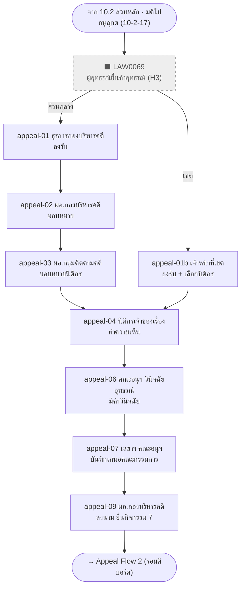
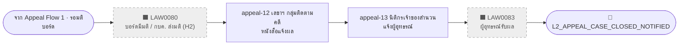

# กิจกรรมที่ 10.2 (อุทธรณ์) — Overall Flow (Role · Page · Step · Status · LAW)

> สร้าง: 2026-09-24 · ขอบเขต: `10-2-appeal-*.html` (อุทธรณ์คำสั่งไม่เปิดเผย — แยกจากส่วนหลัก 10.2)
> ตำแหน่งไฟล์: `E-CMIS-A4/docs/` — path โค้ด/หน้า (`assets/...`, `*.html`) อ้างอิงจาก `activity10/`
> ✅ ตรวจกับโค้ดแล้ว 2026-09-24: หน้า / role key / statusCode / LAW (ที่ไม่มี `*`) ทุกแถวมีอยู่จริง และสถานะปลายทาง (→) ทุกตัวถูกเขียนโดยหน้านั้นจริง (ตรง ๆ, ผ่าน `STEPS`, ฟังก์ชัน engine, หรือตาราง branch เช่น `VERDICT_BRANCHES` / `COVER_SIGNER_ROUTES`) · แถว N… (ไม่มีหน้าจอ): statusCode ที่อ้างถึงมีอยู่ในโค้ดจริง · ผัง Mermaid ทุกผังผ่านการ parse ด้วย mermaid v11
> ไฟล์คู่: [activity10-flow-10.2.md](activity10-flow-10.2.md) (ส่วนหลัก 10.2) · [activity10-flow-10.1.md](activity10-flow-10.1.md) · [activity10-flow-10.3.md](activity10-flow-10.3.md)
>
> **แหล่งข้อมูลหลัก (ยึดโค้ดเป็นหลัก):** `assets/ecmis-10-2.js` (`STEPS` / `ROUTES`) + patch `Activity102.advance()` ในแต่ละหน้า
>
> **หมายเหตุ LAW index:** ไม่มี `*` = เขียนอยู่ใน HTML ของหน้า · มี `*` = อนุมานจากเอกสาร
> `FT` = [10-2-full-test-flow.md](../activity10/docs/10-2-full-test-flow.md) · `AT` = [10-2-appeal-test-flow.md](../activity10/docs/10-2-appeal-test-flow.md) · `P2` = [10-2-part2-page-reference.md](../activity10/docs/10-2-part2-page-reference.md) · `DIO` = `10.2 mockup/TO-BE10.2-swimlane-split.drawio`
> "(ใหม่)" = ขั้นตอนที่เพิ่มใน TO-BE ไม่มีรหัส LAW ใน AS-IS
>
> **สัญลักษณ์ในผัง:** กล่องทึบ = มีหน้าจอ · กล่องเส้นประสีเทา = ⬛ ไม่มีหน้าจอ (ภายนอก / ระบบจำลอง / ยังไม่สร้าง) ·
> ข้าวหลามตัด = จุดตัดสินใจ · กล่องมุมมน = ทางออก / ส่งต่อ · เส้นประ = ตีกลับ หรือ ทางแยกรอง
> **แถว N…** ในตาราง = ขั้นตอน ⬛ ไม่มีหน้าจอ (ใส่เพื่อให้ flow ครบตามผัง AS-IS / TO-BE)
>
> **Inbox label (ก่อน → หลัง):** ข้อความสถานะ (ฟิลด์ `status`) ที่ `01-work-inbox.html` แสดงเป็นแบดจ์ในคอลัมน์สถานะ —
> **ก่อน** = ข้อความที่เห็นในกล่องงานขณะรอขั้นนี้ · **หลัง** = ข้อความหลังขั้นนี้ทำเสร็จ (หลายผลลัพธ์เรียงตามลำดับใน statusCode) ·
> «x/y», «n หน่วยงาน», «เลขพัสดุ» = ค่าที่ระบบเติมตอนรันจริง · (console snippet) = ข้อความจาก snippet ทดสอบ เพราะไม่มีหน้าจอเขียน
> **แบดจ์เสริมข้างสถานะ (＋):** แสดงเมื่อมีมติแล้ว (ตั้งแต่ 10-2-06) และไม่อยู่ในช่วงรอผู้บริหารตอบ (`PRE_SECGEN_RESPONSE_STATUS_CODES`)
> `B1` = แบดจ์มติ «อนุญาตเปิดเผย» / «อนุญาตเปิดเผยบางส่วน» / «ไม่อนุญาตเปิดเผย» / «อื่นๆ» · `B2` = แบดจ์สถานะคดี «คดีเสร็จสิ้นแล้ว» / «อยู่ระหว่างไต่สวน»


## Roles

| Code key | บทบาท |
| --- | --- |
| `case_bureau_admin` | ธุรการกองบริหารคดี |
| `district_admin` | เจ้าหน้าที่เขต |
| `case_bureau_director` | ผู้อำนวยการกองบริหารคดี |
| `case_tracking_director` | ผู้อำนวยการกลุ่มงานบริหารติดตามคดี |
| `case_tracking_secretary` | เลขานุการกลุ่มงานบริหารติดตามคดี |
| `original_officer` | นิติกร / นักสืบเจ้าของเรื่อง |
| `appeal_ruling_subcommittee` | คณะอนุกรรมการวินิจฉัยอุทธรณ์คำสั่งไม่เปิดเผยข้อมูลฯ |
| `appeal_subcommittee_secretariat` | ฝ่ายเลขาคณะอนุกรรมการวินิจฉัยอุทธรณ์ |

## ภาพรวมเส้นทาง

```
10.2 ส่วนหลัก · มติไม่อนุญาต (10-2-17) ─► 🏁 L2_CASE_CLOSED_DENY_ASSIGNED
  └─ ⬛ ผู้อุทธรณ์ยื่นคำอุทธรณ์ (H3)
        ├─ Appeal Flow 1 — รับเรื่องอุทธรณ์และวินิจฉัย (appeal-01 / 01b … 09) ─► ⬛ รอมติบอร์ด
        └─ Appeal Flow 2 — แจ้งผลมติผู้อุทธรณ์ (⬛ H2 … appeal-12, 13) ─► 🏁 L2_APPEAL_CASE_CLOSED_NOTIFIED
```

---

## Appeal Flow 1 — รับเรื่องอุทธรณ์และวินิจฉัย (LAW0069–0079)

> ทางเข้า: เหตุการณ์ภายนอก (console snippet H3 / seed) เปลี่ยน `L2_CASE_CLOSED_DENY_ASSIGNED` → `L2_PENDING_APPEAL_INTAKE` (ส่วนกลาง) หรือ `L2_PENDING_APPEAL_INTAKE_DISTRICT` (เขต) — LAW0069* = ผู้อุทธรณ์ยื่นเรื่อง



| # | Role | Page | Step | statusCode (from → to) | Inbox label (ก่อน → หลัง) | LAW index | Action (TH) | Next page / branch |
| --- | --- | --- | --- | --- | --- | --- | --- | --- |
| N7 | ผู้อุทธรณ์ (ภายนอก) | ⬛ ไม่มีหน้าจอ | LAW0069 | `L2_CASE_CLOSED_DENY_ASSIGNED` → `L2_PENDING_APPEAL_INTAKE` / `L2_PENDING_APPEAL_INTAKE_DISTRICT` (console snippet H3) | ก่อน: «สิ้นสุด — มอบหมายกอง/สำนักเจ้าของสำนวนแล้ว»<br>หลัง: «รอรับเรื่องอุทธรณ์» (console snippet) / «รอรับเรื่องอุทธรณ์» (console snippet)<br>＋ B1 B2 | LAW0069* (DIO) | ยื่นคำอุทธรณ์คำสั่งไม่เปิดเผย (ที่ส่วนกลาง หรือ ที่เขต) | E1 (ส่วนกลาง) / E1b (เขต) |
| E1 | ธุรการกองบริหารคดี `case_bureau_admin` | `10-2-appeal-01-legal-admin-intake.html` | L2-APPEAL-INTAKE (seq 40) ช่องทางส่วนกลาง | `L2_PENDING_APPEAL_INTAKE` → `L2_PENDING_BUREAU_DIRECTOR_ASSIGN` | ก่อน: «รอรับเรื่องอุทธรณ์»<br>หลัง: «ผอ.กองบริหารคดีพิจารณาเรื่องอุทธรณ์และมอบหมาย»<br>＋ B1 B2 | LAW0070–0071* (AT, FT, DIO) | ลงรับเรื่องอุทธรณ์ บันทึกเข้าระบบ | appeal-02 |
| E1b | เจ้าหน้าที่เขต `district_admin` | `10-2-appeal-01b-district-intake.html` | L2-APPEAL-INTAKE-DISTRICT (seq 41) ช่องทางเขต | `L2_PENDING_APPEAL_INTAKE_DISTRICT` → `L2_PENDING_CASE_OWNER_APPEAL_OPINION` | ก่อน: «รอรับเรื่องอุทธรณ์»<br>หลัง: «นิติกรเจ้าของสำนวนแจ้งผู้อุทธรณ์และทำความเห็น»<br>＋ B1 B2 | LAW0070–0071* (DIO) | รับเรื่องอุทธรณ์สายเขต + เลือกนิติกรเจ้าของเรื่อง | appeal-04 (ข้าม 02/03) |
| E2 | ผอ.กองบริหารคดี `case_bureau_director` | `10-2-appeal-02-case-bureau-director-assign.html` | L2-APPEAL-BUREAU-ASSIGN (seq 42) | `L2_PENDING_BUREAU_DIRECTOR_ASSIGN` → `L2_PENDING_TRACKING_DIRECTOR_ASSIGN` | ก่อน: «ผอ.กองบริหารคดีพิจารณาเรื่องอุทธรณ์และมอบหมาย»<br>หลัง: «ผอ.กลุ่มงานบริหารติดตามคดีพิจารณาและมอบหมายนิติกร»<br>＋ B1 B2 | LAW0072* (DIO) | พิจารณาเรื่องอุทธรณ์ + มอบหมาย | appeal-03 |
| E3 | ผอ.กลุ่มงานบริหารติดตามคดี `case_tracking_director` | `10-2-appeal-03-case-tracking-director-assign.html` | L2-APPEAL-TRACKING-ASSIGN (seq 43) | `L2_PENDING_TRACKING_DIRECTOR_ASSIGN` → `L2_PENDING_CASE_OWNER_APPEAL_OPINION` | ก่อน: «ผอ.กลุ่มงานบริหารติดตามคดีพิจารณาและมอบหมายนิติกร»<br>หลัง: «นิติกรเจ้าของสำนวนแจ้งผู้อุทธรณ์และทำความเห็น»<br>＋ B1 B2 | LAW0073* (DIO) | พิจารณา + มอบหมายนิติกร | appeal-04 (ส่วนกลาง/เขตมาบรรจบ) |
| E4 | นิติกร/นักสืบเจ้าของเรื่อง `original_officer` | `10-2-appeal-04-case-owner-opinion.html` | L2-APPEAL-CASE-OWNER-OPINION (seq 43) | `L2_PENDING_CASE_OWNER_APPEAL_OPINION` → `L2_PENDING_APPEAL_RULING` | ก่อน: «นิติกรเจ้าของสำนวนแจ้งผู้อุทธรณ์และทำความเห็น»<br>หลัง: «คณะอนุกรรมการวินิจฉัยอุทธรณ์พิจารณาและมีคำวินิจฉัย»<br>＋ B1 B2 | LAW0074* (AT, FT, DIO) | แจ้งผู้อุทธรณ์ (3 วัน) + ทำความเห็น (10 วัน) | appeal-06 |
| E6 | คณะอนุฯ วินิจฉัยอุทธรณ์ `appeal_ruling_subcommittee` | `10-2-appeal-06-subcommittee-ruling.html` | L2-APPEAL-RULING (seq 44) · บันทึก `l2AppealRulingType` | `L2_PENDING_APPEAL_RULING` → `L2_PENDING_APPEAL_MEMO` | ก่อน: «คณะอนุกรรมการวินิจฉัยอุทธรณ์พิจารณาและมีคำวินิจฉัย»<br>หลัง: «ฝ่ายเลขาคณะอนุกรรมการวินิจฉัยอุทธรณ์จัดทำบันทึกเสนอคณะกรรมการ ป.ป.ท.»<br>＋ B1 B2 | LAW0076* | มีคำวินิจฉัยอุทธรณ์ + ลงนาม | appeal-07 |
| E7 | ฝ่ายเลขาคณะอนุฯ วินิจฉัยอุทธรณ์ `appeal_subcommittee_secretariat` | `10-2-appeal-07-secretariat-memo.html` | L2-APPEAL-SECRETARIAT-MEMO (seq 45) | `L2_PENDING_APPEAL_MEMO` → `L2_PENDING_BUREAU_DIRECTOR_BOARD_PROPOSE` | ก่อน: «ฝ่ายเลขาคณะอนุกรรมการวินิจฉัยอุทธรณ์จัดทำบันทึกเสนอคณะกรรมการ ป.ป.ท.»<br>หลัง: «ผอ.กองบริหารคดีพิจารณาและลงนามเสนอกิจกรรมที่ 7»<br>＋ B1 B2 | LAW0075*, 0077* (FT) | บันทึกวาระประชุม + จัดทำบันทึกเสนอคณะกรรมการ | appeal-09 |
| E9 | ผอ.กองบริหารคดี `case_bureau_director` | `10-2-appeal-09-case-bureau-director-board-propose.html` | L2-APPEAL-BOARD-PROPOSE (seq 48) | `L2_PENDING_BUREAU_DIRECTOR_BOARD_PROPOSE` → `L2_APPEAL_SUBMITTED_TO_BOARD` | ก่อน: «ผอ.กองบริหารคดีพิจารณาและลงนามเสนอกิจกรรมที่ 7»<br>หลัง: «รอมติบอร์ดตอบกลับ»<br>＋ B1 B2 | LAW0078*, 0079* (FT) | ลงนามผู้เสนอ + ออกเลขส่งยื่นกิจกรรม 7 | ⬛ รอบอร์ด (H2 ≈ LAW0080 เขียน `L2_PENDING_APPEAL_NOTICE_DRAFT`) → appeal-12 |

## Appeal Flow 2 — แจ้งผลมติผู้อุทธรณ์ (LAW0080–0083)



| # | Role | Page | Step | statusCode (from → to) | Inbox label (ก่อน → หลัง) | LAW index | Action (TH) | Next page / branch |
| --- | --- | --- | --- | --- | --- | --- | --- | --- |
| N8 | คณะกรรมการ ป.ป.ท. + กบค. (กลุ่มงานคำวินิจฉัยและมติคณะกรรมการ) | ⬛ ไม่มีหน้าจอ | LAW0080 | `L2_APPEAL_SUBMITTED_TO_BOARD` → `L2_PENDING_APPEAL_NOTICE_DRAFT` (console snippet H2) | ก่อน: «รอมติบอร์ดตอบกลับ»<br>หลัง: «เลขานุการกลุ่มงานบริหารติดตามคดีจัดทำหนังสือแจ้งผลมติ»<br>＋ B1 B2 | LAW0080* (DIO) | บอร์ดมีมติ กบค. ส่งมติคณะกรรมการ | appeal-12 |
| E12 | เลขานุการกลุ่มงานบริหารติดตามคดี `case_tracking_secretary` | `10-2-appeal-12-tracking-secretary-notice-draft.html` | L2-APPEAL-NOTICE-DRAFT-2 (seq 51) | `L2_PENDING_APPEAL_NOTICE_DRAFT` → `L2_PENDING_APPEAL_CASE_OWNER_NOTIFY` | ก่อน: «เลขานุการกลุ่มงานบริหารติดตามคดีจัดทำหนังสือแจ้งผลมติ»<br>หลัง: «นิติกรเจ้าของสำนวนแจ้งผลผู้อุทธรณ์»<br>＋ B1 B2 | LAW0081* (FT) | จัดทำหนังสือแจ้งผลมติ + ลงนาม | appeal-13 |
| E13 | นิติกรเจ้าของสำนวน `original_officer` | `10-2-appeal-13-case-owner-notify-appellant.html` | L2-APPEAL-CASE-OWNER-NOTIFY (seq 52) | `L2_PENDING_APPEAL_CASE_OWNER_NOTIFY` → `L2_APPEAL_CASE_CLOSED_NOTIFIED` | ก่อน: «นิติกรเจ้าของสำนวนแจ้งผลผู้อุทธรณ์»<br>หลัง: «สิ้นสุด — แจ้งผลผู้อุทธรณ์แล้ว»<br>＋ B1 B2 | LAW0082*, 0083* (FT) | แจ้งผลคำวินิจฉัยให้ผู้อุทธรณ์ (5 วัน) | 🏁 จบ 10.2 อุทธรณ์ |
| N9 | ผู้อุทธรณ์ (ภายนอก) | ⬛ ไม่มีหน้าจอ | LAW0083 | — | — | LAW0083* (DIO — พับรวมที่ appeal-13) | ได้รับผลคำวินิจฉัยภายใน 5 วัน | 🏁 |

---

## Terminal / Waiting statuses

| ประเภท | statusCode |
| --- | --- |
| 🏁 Terminal | `L2_APPEAL_CASE_CLOSED_NOTIFIED` |
| ⬛ รอภายนอก (ไม่มีหน้า — ใช้ console snippet) | `L2_CASE_CLOSED_DENY_ASSIGNED` → H3 → `L2_PENDING_APPEAL_INTAKE` / `L2_PENDING_APPEAL_INTAKE_DISTRICT` · `L2_APPEAL_SUBMITTED_TO_BOARD` → H2 → `L2_PENDING_APPEAL_NOTICE_DRAFT` |

## เลขหน้าที่หายไป (ตัด / รวม / ไม่ได้สร้าง)

| เลขหน้า | สถานะ | หลักฐาน |
| --- | --- | --- |
| appeal-05 (LAW0075) | รวมเข้า appeal-07 | commit `97a07de` + STEPS comment |
| appeal-08 | ตัด (ไม่มี LAW) | commit `97a07de` |
| appeal-10 (LAW0079) | รวมเข้า appeal-09 | commit `97a07de` |
| appeal-11 (LAW0080) | แทนด้วย snippet H2 | commit `97a07de` |

**รหัส LAW ใน drawio ที่ไม่มีหน้าของตัวเอง:** LAW0069 (H3), LAW0080 (H2), LAW0083 (รวมใน appeal-13)

## ⚠ ข้อสังเกตที่พบ

1. **เอกสารเก่า:** `10-2-full-test-flow.md` ยังบอก appeal-01 → 04 ตรง (ปัจจุบัน appeal-01 → 02 → 03 → 04 และมีช่องทางเขต 01b) · `10-2-flow4-appeal-plan.md` ยังใช้ `L2_PENDING_APPEAL_BOARD_DISPATCH`
2. **appeal-06** บันทึกคำวินิจฉัย (`l2AppealRulingType`) แต่ไม่แยกสถานะตามผลวินิจฉัย — ทุกผลไป appeal-07 เหมือนกัน
