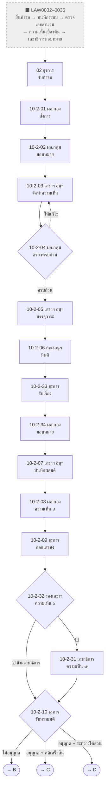
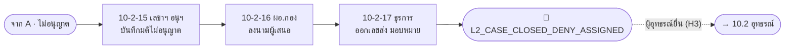
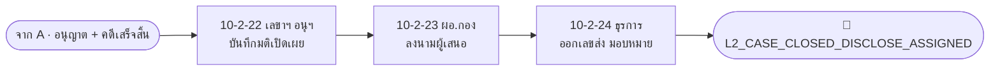
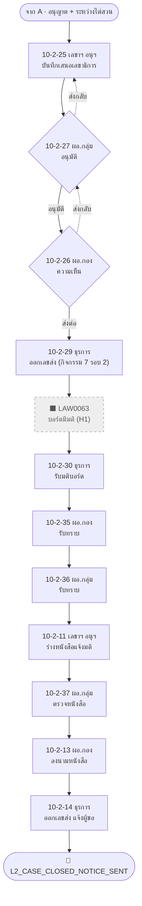

# กิจกรรมที่ 10.2 — Overall Flow (Role · Page · Step · Status · LAW)

> สร้าง: 2026-09-24 · ขอบเขต: `10-2-*.html` (ส่วนหลัก — อุทธรณ์แยกไปที่ [activity10-flow-10.2-appeal.md](activity10-flow-10.2-appeal.md))
> ตำแหน่งไฟล์: `E-CMIS-A4/docs/` — path โค้ด/หน้า (`assets/...`, `*.html`) อ้างอิงจาก `activity10/`
> ✅ ตรวจกับโค้ดแล้ว 2026-09-24: หน้า / role key / statusCode / LAW (ที่ไม่มี `*`) ทุกแถวมีอยู่จริง และสถานะปลายทาง (→) ทุกตัวถูกเขียนโดยหน้านั้นจริง (ตรง ๆ, ผ่าน `STEPS`, ฟังก์ชัน engine, หรือตาราง branch เช่น `VERDICT_BRANCHES` / `COVER_SIGNER_ROUTES`) · แถว N… (ไม่มีหน้าจอ): statusCode ที่อ้างถึงมีอยู่ในโค้ดจริง · ผัง Mermaid ทุกผังผ่านการ parse ด้วย mermaid v11
> ไฟล์คู่: [activity10-flow-10.2-appeal.md](activity10-flow-10.2-appeal.md) (10.2 อุทธรณ์) · [activity10-flow-10.1.md](activity10-flow-10.1.md) · [activity10-flow-10.3.md](activity10-flow-10.3.md)
>
> **แหล่งข้อมูลหลัก (ยึดโค้ดเป็นหลัก):** `assets/ecmis-10-2.js` (`STEPS` / `ROUTES`) + patch `Activity102.advance()` ในแต่ละหน้า
>
> **หมายเหตุ LAW index:** ไม่มี `*` = เขียนอยู่ใน HTML ของหน้า · มี `*` = อนุมานจากเอกสาร
> `FT` = [10-2-full-test-flow.md](../activity10/docs/10-2-full-test-flow.md) · `AT` = [10-2-appeal-test-flow.md](../activity10/docs/10-2-appeal-test-flow.md) · `P2` = [10-2-part2-page-reference.md](../activity10/docs/10-2-part2-page-reference.md) · `DIO` = `10.2 mockup/TO-BE10.2-swimlane-split.drawio`
> "(ใหม่)" = ขั้นตอนที่เพิ่มใน TO-BE ไม่มีรหัส LAW ใน AS-IS
>
> **สัญลักษณ์ในผัง:** กล่องทึบ = มีหน้าจอ · กล่องเส้นประสีเทา = ⬛ ไม่มีหน้าจอ (ภายนอก / ระบบจำลอง / ยังไม่สร้าง) ·
> ข้าวหลามตัด = จุดตัดสินใจ · กล่องมุมมน = ทางออก / ส่งต่อ · เส้นประ = ตีกลับ หรือ ทางแยกรอง
> **แถว N…** ในตาราง = ขั้นตอน ⬛ ไม่มีหน้าจอ (ใส่เพื่อให้ flow ครบตามผัง AS-IS / TO-BE)
>
> **Inbox label (ก่อน → หลัง):** ข้อความสถานะ (ฟิลด์ `status`) ที่ `01-work-inbox.html` แสดงเป็นแบดจ์ในคอลัมน์สถานะ —
> **ก่อน** = ข้อความที่เห็นในกล่องงานขณะรอขั้นนี้ · **หลัง** = ข้อความหลังขั้นนี้ทำเสร็จ (หลายผลลัพธ์เรียงตามลำดับใน statusCode) ·
> «x/y», «n หน่วยงาน», «เลขพัสดุ» = ค่าที่ระบบเติมตอนรันจริง · (console snippet) = ข้อความจาก snippet ทดสอบ เพราะไม่มีหน้าจอเขียน
> **แบดจ์เสริมข้างสถานะ (＋):** แสดงเมื่อมีมติแล้ว (ตั้งแต่ 10-2-06) และไม่อยู่ในช่วงรอผู้บริหารตอบ (`PRE_SECGEN_RESPONSE_STATUS_CODES`)
> `B1` = แบดจ์มติ «อนุญาตเปิดเผย» / «อนุญาตเปิดเผยบางส่วน» / «ไม่อนุญาตเปิดเผย» / «อื่นๆ» · `B2` = แบดจ์สถานะคดี «คดีเสร็จสิ้นแล้ว» / «อยู่ระหว่างไต่สวน»

## Roles

| Code key | บทบาท |
| --- | --- |
| `admin_legal` | เจ้าหน้าที่ธุรการกองกฎหมาย |
| `dir_legal` | ผู้อำนวยการกองกฎหมาย |
| `group_director` | ผู้อำนวยการกลุ่มงานความเห็นแย้ง |
| `sub_secretariat` | ฝ่ายเลขานุการคณะอนุกรรมการพิจารณากลั่นกรองฯ |
| `subcommittee_screen` | คณะอนุกรรมการพิจารณากลั่นกรองการเปิดเผยข้อมูลข่าวสาร |
| `deputy_sg` | รองเลขาธิการ ป.ป.ท. ผู้ดูแลกองกฎหมาย |
| `secgen` | เลขาธิการ คณะกรรมการ ป.ป.ท. |

## ภาพรวมเส้นทาง

```
02-board-intake (LAW0037)
  └─ A. ส่วนร่วม (10-2-01 … 10-2-10)
        ├─ มติ = ไม่อนุญาต ─────────────────► B. Deny (15 → 16 → 17) 🏁 ──(อุทธรณ์ H3)──► เอกสาร 10.2 อุทธรณ์
        ├─ อนุญาต/บางส่วน + คดีเสร็จสิ้น ──► C. Close (22 → 23 → 24) 🏁
        └─ อนุญาต/บางส่วน + ระหว่างไต่สวน ─► D. Committee รอบ 2 → บอร์ด → แจ้งมติ (25 … 14) 🏁
```

---

## A. ส่วนร่วม — รับคำขอเปิดเผยข้อมูล มติคณะอนุฯ และความเห็นผู้บริหาร



| # | Role | Page | Step | statusCode (from → to) | Inbox label (ก่อน → หลัง) | LAW index | Action (TH) | Next page / branch |
| --- | --- | --- | --- | --- | --- | --- | --- | --- |
| N1 | ผู้ยื่นคำขอ (ภายนอก) | ⬛ ไม่มีหน้าจอ | LAW0032 | — | — | LAW0032* (DIO) | ยื่นคำขอเปิดเผยข้อมูลหรือข้อเท็จจริง | N2 |
| N2 | ระบบ E-CMIS | ⬛ ไม่มีหน้าจอ | LAW0033 | — | — | LAW0033* (DIO) | บันทึกเข้าสู่ระบบ E-CMIS | N3 |
| N3 | สำนักงาน ป.ป.ท. (เขต / ส่วนกลาง / ศรร.) | ⬛ ไม่มีหน้าจอ | LAW0034 | — | — | LAW0034* (DIO) | ตรวจสอบเลขสำนวนคดี | N4 |
| N4 | สำนัก/กองที่รับผิดชอบสำนวนคดี | ⬛ ไม่มีหน้าจอ | LAW0035 | — | — | LAW0035* (DIO) | ทำรายงานความเห็นเบื้องต้นเสนอ | N5 |
| N5 | เลขาธิการคณะกรรมการ ป.ป.ท. | ⬛ ไม่มีหน้าจอ | LAW0036 | — | — | LAW0036* (DIO) | มอบหมายกองกฎหมาย | A0 |
| A0 | ธุรการกองกฎหมาย `admin_legal` | `02-board-intake.html` (category disclosure) | LAW0037 (seq 6) | (เคสใหม่) → `L2_PENDING_DIRECTOR_ASSIGN` | หลัง: «ผอ.กองกฎหมายพิจารณาสั่งการ» | LAW0037 | รับคำขอเปิดเผยข้อมูลข่าวสาร บันทึกเข้าระบบ | 10-2-01 |
| A1 | ผอ.กองกฎหมาย `dir_legal` | `10-2-01-legal-director-assign.html` | LAW0038 (seq 7) ผอ.กอง สั่งการ | `L2_PENDING_DIRECTOR_ASSIGN` → `L2_PENDING_GROUP_ASSIGN` | ก่อน: «ผอ.กองกฎหมายพิจารณาสั่งการ»<br>หลัง: «ผอ.กลุ่มงานความเห็นแย้งตรวจประเด็นกฎหมาย» | LAW0038 | พิจารณาสั่งการ มอบหมายงาน + ลงนาม | 10-2-02 |
| A2 | ผอ.กลุ่มงานความเห็นแย้ง `group_director` | `10-2-02-group-director-assign.html` | LAW0039 (seq 8) | `L2_PENDING_GROUP_ASSIGN` → `L2_PENDING_SECRETARIAT_OPINION` | ก่อน: «ผอ.กลุ่มงานความเห็นแย้งตรวจประเด็นกฎหมาย»<br>หลัง: «ฝ่ายเลขานุการฯ จัดทำรายงานความเห็น» | LAW0039 | ตรวจประเด็นกฎหมาย มอบหมายฝ่ายเลขาฯ | 10-2-03 |
| A3 | ฝ่ายเลขานุการฯ `sub_secretariat` | `10-2-03-secretariat-opinion.html` | LAW0040 (seq 9) | `L2_PENDING_SECRETARIAT_OPINION` → `L2_PENDING_GROUP_VERIFY` | ก่อน: «ฝ่ายเลขานุการฯ จัดทำรายงานความเห็น» (ถ้าถูกส่งกลับ: «ฝ่ายเลขานุการฯ จัดทำรายงานความเห็น»)<br>หลัง: «ผอ.กลุ่มงานความเห็นแย้งตรวจความครบถ้วน» | LAW0040 | จัดทำรายงานความเห็นเสนอคณะอนุฯ | 10-2-04 |
| A4 | ผอ.กลุ่มงาน `group_director` | `10-2-04-group-director-verify.html` | LAW0041 (seq 10) | `L2_PENDING_GROUP_VERIFY` → `L2_PENDING_AGENDA` (ครบถ้วน) / → `L2_PENDING_SECRETARIAT_OPINION` (ให้แก้ไข) | ก่อน: «ผอ.กลุ่มงานความเห็นแย้งตรวจความครบถ้วน»<br>หลัง: «ฝ่ายเลขานุการฯ บรรจุวาระและนัดหมายประชุม» / «ฝ่ายเลขานุการฯ จัดทำรายงานความเห็น» | LAW0041 | ตรวจความครบถ้วนประเด็นกฎหมาย | ✔ 10-2-05 · ✘ กลับ 10-2-03 |
| A5 | ฝ่ายเลขานุการฯ `sub_secretariat` | `10-2-05-secretariat-agenda.html` | LAW0042-0043 (seq 11) | `L2_PENDING_AGENDA` → `L2_PENDING_SUBCOMMITTEE` | ก่อน: «ฝ่ายเลขานุการฯ บรรจุวาระและนัดหมายประชุม»<br>หลัง: «คณะอนุกรรมการฯ พิจารณาตามระเบียบวาระ» | LAW0042, 0043 | บรรจุวาระ นัดหมาย ส่งเอกสารประชุม | 10-2-06 |
| A6 | คณะอนุกรรมการกลั่นกรองฯ `subcommittee_screen` | `10-2-06-subcommittee-resolution.html` | LAW0044 (seq 13) · บันทึก `l2ResolutionType` (DISCLOSE/PARTIAL/DENY/OTHER) + `l2CaseState` (CLOSED/INVESTIGATING) | `L2_PENDING_SUBCOMMITTEE` → `L2_PENDING_RESOLUTION_DOC` | ก่อน: «คณะอนุกรรมการฯ พิจารณาตามระเบียบวาระ»<br>หลัง: «ธุรการกองกฎหมายรับเรื่อง» | LAW0044 | บันทึกมติที่ประชุมและสถานะคดี + ลงนาม | 10-2-33 (ค่ามติใช้แยกสายที่ 10-2-10) |
| A7 | ธุรการกองกฎหมาย `admin_legal` | `10-2-33-legal-admin-comment.html` | L2-ADMIN-PRECOMMENT (seq 12) | `L2_PENDING_RESOLUTION_DOC` → `L2_PENDING_DIRLEGAL_PRECOMMENT` | ก่อน: «ธุรการกองกฎหมายรับเรื่อง»<br>หลัง: «ผู้อำนวยการกองกฎหมายมอบหมาย»<br>＋ B1 B2 | — (ใหม่) | รับเรื่องหลังมติ | 10-2-34 |
| A8 | ผอ.กองกฎหมาย `dir_legal` | `10-2-34-legal-director-comment.html` | L2-DIRLEGAL-PRECOMMENT (seq 12) | `L2_PENDING_DIRLEGAL_PRECOMMENT` → `L2_PENDING_SECRETARIAT_DRAFT` | ก่อน: «ผู้อำนวยการกองกฎหมายมอบหมาย»<br>หลัง: «ฝ่ายเลขานุการฯ ทำบันทึกผลมติเลขา»<br>＋ B1 B2 | — (ใหม่) | มอบหมายฝ่ายเลขาฯ ทำบันทึกผลมติ | 10-2-07 |
| A9 | ฝ่ายเลขานุการฯ `sub_secretariat` | `10-2-07-secretariat-resolution-doc.html` | LAW0045-0046 (seq 14) | `L2_PENDING_SECRETARIAT_DRAFT` → `L2_PENDING_DIRLEGAL_OPINION` | ก่อน: «ฝ่ายเลขานุการฯ ทำบันทึกผลมติเลขา»<br>หลัง: «ผอ.กองกฎหมายพิจารณาให้ความเห็น (๕)» | LAW0045, 0046 | ทำบันทึกผลมติ ออกเลขส่งภายใน ลงนามผู้เสนอ | 10-2-08 |
| A10 | ผอ.กองกฎหมาย `dir_legal` | `10-2-08-legal-director-propose.html` | LAW0045.1 (seq 15) | `L2_PENDING_DIRLEGAL_OPINION` → `L2_PENDING_DISPATCH` | ก่อน: «ผอ.กองกฎหมายพิจารณาให้ความเห็น (๕)»<br>หลัง: «ธุรการกองกฎหมายออกเลขส่งเสนอผู้บริหาร» | LAW0045.1 | ให้ความเห็น (๕) + ลงนาม | 10-2-09 |
| A11 | ธุรการกองกฎหมาย `admin_legal` | `10-2-09-legal-admin-dispatch.html` | L2-DISPATCH (seq 16) | `L2_PENDING_DISPATCH` → `L2_PENDING_DEPUTY_SG_OPINION` (hard-code) | ก่อน: «ธุรการกองกฎหมายออกเลขส่งเสนอผู้บริหาร»<br>หลัง: «รองเลขาธิการ ป.ป.ท. ผู้ดูแลกองกฎหมาย พิจารณาให้ความเห็นและลงนาม» | — (ใหม่) | ออกเลขส่งเสนอรองเลขาธิการ | 10-2-32 |
| A12 | รองเลขาธิการ `deputy_sg` | `10-2-32-deputy-sg-opinion-sign.html` | L2-DEPUTY-SG-OPINION (seq 17) | `L2_PENDING_DEPUTY_SG_OPINION` → `L2_DEPUTY_SG_RESOLVED` (☑ `in_skipSecgen`) / → `L2_PENDING_SECGEN_OPINION` (☐) | ก่อน: «รองเลขาธิการ ป.ป.ท. ผู้ดูแลกองกฎหมาย พิจารณาให้ความเห็นและลงนาม»<br>หลัง: «เลขาธิการ ป.ป.ท. ตอบกลับแล้ว» / «เลขาธิการ ป.ป.ท. ผู้ดูแลกองกฎหมาย พิจารณาให้ความเห็นและลงนาม»<br>＋ B1 B2 | LAW0047* (FT, DIO) | ให้ความเห็น (๖) แก้มติ/สถานะคดีได้ + ลงนาม | ☑ 10-2-10 · ☐ 10-2-31 |
| A13 | เลขาธิการ `secgen` | `10-2-31-secgen-opinion-sign.html` | L2-SECGEN-OPINION (seq 18) | `L2_PENDING_SECGEN_OPINION` → `L2_SECGEN_RESOLVED` | ก่อน: «เลขาธิการ ป.ป.ท. ผู้ดูแลกองกฎหมาย พิจารณาให้ความเห็นและลงนาม»<br>หลัง: «เลขาธิการ ป.ป.ท. ตอบกลับแล้ว»<br>＋ B1 B2 | — (ใหม่) | ให้ความเห็น (๗) แก้มติ/สถานะคดีได้ + ลงนาม | 10-2-10 |
| A14 | ธุรการกองกฎหมาย `admin_legal` | `10-2-10-legal-admin-receive-outcome.html` | L2-RECEIVE-OUTCOME (seq 18) | `L2_DEPUTY_SG_RESOLVED` / `L2_SECGEN_RESOLVED` → `L2_PENDING_DENY_MEMO` (DENY) / → `L2_PENDING_CLOSE_MEMO` (ไม่ DENY + CLOSED) / → `L2_PENDING_COMMITTEE_MEMO_DRAFT` (อื่นๆ) | ก่อน: «เลขาธิการ ป.ป.ท. ตอบกลับแล้ว»<br>หลัง: «ฝ่ายเลขานุการฯ จัดทำบันทึกและมติไม่อนุญาตเปิดเผยข้อมูล» / «ฝ่ายเลขานุการฯ จัดทำบันทึกและมติ (คดีเสร็จสิ้นแล้ว)» / «ฝ่ายเลขานุการฯ จัดทำมติคณะอนุกรรมการฯ และบันทึกเสนอเลขาธิการ»<br>＋ B1 B2 | LAW0049* / 0053* / 0058* (FT, P2) | รับทราบมติ (read-only) ส่งต่อฝ่ายเลขาฯ | 🔀 → B (10-2-15) · C (10-2-22) · D (10-2-25) |

## B. มติไม่อนุญาตเปิดเผย



| # | Role | Page | Step | statusCode (from → to) | Inbox label (ก่อน → หลัง) | LAW index | Action (TH) | Next page / branch |
| --- | --- | --- | --- | --- | --- | --- | --- | --- |
| B1 | ฝ่ายเลขานุการฯ `sub_secretariat` | `10-2-15-secretariat-deny-memo.html` | L2-DENY-MEMO (seq 22) | `L2_PENDING_DENY_MEMO` → `L2_PENDING_DENY_PROPOSE` | ก่อน: «ฝ่ายเลขานุการฯ จัดทำบันทึกและมติไม่อนุญาตเปิดเผยข้อมูล»<br>หลัง: «ผอ.กองกฎหมายพิจารณาเสนอเลขาธิการคณะกรรมการ ป.ป.ท.»<br>＋ B1 B2 | LAW0050–0051* (FT) | จัดทำบันทึก + มติไม่อนุญาต ลงนาม ออกเลขภายใน | 10-2-16 |
| B2 | ผอ.กองกฎหมาย `dir_legal` | `10-2-16-legal-director-deny-propose.html` | L2-DENY-PROPOSE (seq 23) | `L2_PENDING_DENY_PROPOSE` → `L2_PENDING_DENY_DISPATCH_COMMITTEE` | ก่อน: «ผอ.กองกฎหมายพิจารณาเสนอเลขาธิการคณะกรรมการ ป.ป.ท.»<br>หลัง: «ธุรการกองกฎหมายออกเลขส่งเสนอเลขาธิการคณะกรรมการ ป.ป.ท.»<br>＋ B1 B2 | — (ใหม่) | ลงนามผู้เสนอเรื่อง | 10-2-17 |
| B3 | ธุรการกองกฎหมาย `admin_legal` | `10-2-17-legal-admin-deny-dispatch-committee.html` | L2-DENY-DISPATCH-COMMITTEE (seq 24) | `L2_PENDING_DENY_DISPATCH_COMMITTEE` → `L2_CASE_CLOSED_DENY_ASSIGNED` | ก่อน: «ธุรการกองกฎหมายออกเลขส่งเสนอเลขาธิการคณะกรรมการ ป.ป.ท.»<br>หลัง: «สิ้นสุด — มอบหมายกอง/สำนักเจ้าของสำนวนแล้ว»<br>＋ B1 B2 | LAW0052* (FT) | ออกเลขส่ง มอบหมายกอง/สำนักเจ้าของสำนวนแจ้งผล | 🏁 terminal · (ถ้ามีอุทธรณ์ → เอกสาร 10.2 อุทธรณ์ ผ่าน H3) |

## C. อนุญาตเปิดเผย กรณีคดีเสร็จสิ้น



| # | Role | Page | Step | statusCode (from → to) | Inbox label (ก่อน → หลัง) | LAW index | Action (TH) | Next page / branch |
| --- | --- | --- | --- | --- | --- | --- | --- | --- |
| C1 | ฝ่ายเลขานุการฯ `sub_secretariat` | `10-2-22-secretariat-close-memo.html` | L2-CLOSE-MEMO (seq 25) | `L2_PENDING_CLOSE_MEMO` → `L2_PENDING_CLOSE_PROPOSE` | ก่อน: «ฝ่ายเลขานุการฯ จัดทำบันทึกและมติ (คดีเสร็จสิ้นแล้ว)»<br>หลัง: «ผอ.กองกฎหมายพิจารณาเสนอเลขาธิการคณะกรรมการ ป.ป.ท.»<br>＋ B1 B2 | LAW0054–0055* (FT) | จัดทำบันทึก + มติเปิดเผย ลงนาม ออกเลขภายใน | 10-2-23 |
| C2 | ผอ.กองกฎหมาย `dir_legal` | `10-2-23-legal-director-close-propose.html` | L2-CLOSE-PROPOSE (seq 26) | `L2_PENDING_CLOSE_PROPOSE` → `L2_PENDING_CLOSE_DISPATCH_COMMITTEE` | ก่อน: «ผอ.กองกฎหมายพิจารณาเสนอเลขาธิการคณะกรรมการ ป.ป.ท.»<br>หลัง: «ธุรการกองกฎหมายออกเลขส่งเสนอเลขาธิการคณะกรรมการ ป.ป.ท.»<br>＋ B1 B2 | — (ใหม่) | ลงนามผู้เสนอเรื่อง | 10-2-24 |
| C3 | ธุรการกองกฎหมาย `admin_legal` | `10-2-24-legal-admin-close-dispatch.html` | L2-CLOSE-DISPATCH-COMMITTEE (seq 27) | `L2_PENDING_CLOSE_DISPATCH_COMMITTEE` → `L2_CASE_CLOSED_DISCLOSE_ASSIGNED` | ก่อน: «ธุรการกองกฎหมายออกเลขส่งเสนอเลขาธิการคณะกรรมการ ป.ป.ท.»<br>หลัง: «สิ้นสุด — มอบหมายกอง/สำนักเจ้าของสำนวนแล้ว»<br>＋ B1 B2 | LAW0056–0057* (FT) | ออกเลขส่ง มอบหมายกอง/สำนักเจ้าของสำนวน | 🏁 terminal |

## D. อนุญาตเปิดเผย กรณีระหว่างไต่สวน (เสนอบอร์ดรอบ 2 และแจ้งมติ)



| # | Role | Page | Step | statusCode (from → to) | Inbox label (ก่อน → หลัง) | LAW index | Action (TH) | Next page / branch |
| --- | --- | --- | --- | --- | --- | --- | --- | --- |
| D1 | ฝ่ายเลขานุการฯ `sub_secretariat` | `10-2-25-secretariat-committee-memo-draft.html` | L2-COMMITTEE-MEMO-DRAFT (seq 28) | `L2_PENDING_COMMITTEE_MEMO_DRAFT` → `L2_PENDING_COMMITTEE_DIRECTOR_OPINION` | ก่อน: «ฝ่ายเลขานุการฯ จัดทำมติคณะอนุกรรมการฯ และบันทึกเสนอเลขาธิการ» (ถ้าถูกส่งกลับ: «ผอ.กลุ่มงานความเห็นแย้งพิจารณาอนุมัติ»)<br>หลัง: «ผอ.กลุ่มงานความเห็นแย้งพิจารณาอนุมัติ»<br>＋ B1 B2 | LAW0059* (FT) | จัดทำมติคณะอนุฯ + บันทึกเสนอเลขาธิการ ลงนามผู้เสนอ | 10-2-27 |
| D2 | ผอ.กลุ่มงาน `group_director` | `10-2-27-group-director-committee-approve.html` | L2-COMMITTEE-GROUP-APPROVE (seq 29) | `L2_PENDING_COMMITTEE_DIRECTOR_OPINION` → `L2_PENDING_COMMITTEE_DIRECTOR_OPINION_APPROVED` (อนุมัติ) / → `L2_PENDING_COMMITTEE_MEMO_DRAFT` (ส่งกลับ) | ก่อน: «ผอ.กลุ่มงานความเห็นแย้งพิจารณาอนุมัติ» (ถ้าถูกส่งกลับ: «ผอ.กองกฎหมายพิจารณาให้ความเห็น»)<br>หลัง: «ผอ.กองกฎหมายพิจารณาให้ความเห็น» / «ผอ.กลุ่มงานความเห็นแย้งพิจารณาอนุมัติ»<br>＋ B1 B2 | — (ใหม่) | พิจารณาอนุมัติ + ลงนาม | ✔ 10-2-26 · ✘ กลับ 10-2-25 |
| D3 | ผอ.กองกฎหมาย `dir_legal` | `10-2-26-legal-director-committee-opinion.html` | L2-COMMITTEE-DIRECTOR-OPINION (seq 29) | `L2_PENDING_COMMITTEE_DIRECTOR_OPINION_APPROVED` → `L2_PENDING_COMMITTEE_DISPATCH` / → `L2_PENDING_COMMITTEE_DIRECTOR_OPINION` (ส่งกลับ) | ก่อน: «ผอ.กองกฎหมายพิจารณาให้ความเห็น»<br>หลัง: «ธุรการกองกฎหมายออกเลขส่งเสนอรองเลขาธิการ ป.ป.ท.» / «ผอ.กองกฎหมายพิจารณาให้ความเห็น»<br>＋ B1 B2 | LAW0060* (FT) | ให้ความเห็นในบันทึกเสนอเลขาธิการ + ลงนาม | ✔ 10-2-29 · ✘ กลับ 10-2-27 |
| D4 | ธุรการกองกฎหมาย `admin_legal` | `10-2-29-legal-admin-committee-dispatch.html` | L2-COMMITTEE-DISPATCH (seq 32) | `L2_PENDING_COMMITTEE_DISPATCH` → `L2_READY_FOR_BOARD_ROUND2` | ก่อน: «ธุรการกองกฎหมายออกเลขส่งเสนอรองเลขาธิการ ป.ป.ท.»<br>หลัง: «รอมติคณะกรรมการ ป.ป.ท. (รอบ 2)»<br>＋ B1 B2 | LAW0061–0062* (FT) | ออกเลขส่งเสนอรองเลขาฯ (กิจกรรม 7 รอบ 2) | ⬛ รอบอร์ด (H1 = LAW0063* เขียน `L2_BOARD_RESOLVED_ROUND2`) → 10-2-30 |
| N6 | คณะกรรมการ ป.ป.ท. (บอร์ด) | ⬛ ไม่มีหน้าจอ | LAW0063 | `L2_READY_FOR_BOARD_ROUND2` → `L2_BOARD_RESOLVED_ROUND2` (console snippet H1) | ก่อน: «รอมติคณะกรรมการ ป.ป.ท. (รอบ 2)»<br>หลัง: «มติบอร์ด ตอบกลับแล้ว» (console snippet)<br>＋ B1 B2 | LAW0063* (DIO, FT) | บอร์ดพิจารณามติ เห็นชอบและลงนาม | 10-2-30 |
| D5 | ธุรการกองกฎหมาย `admin_legal` | `10-2-30-legal-admin-receive-board-round2.html` | L2-RECEIVE-BOARD-ROUND2 (seq 33) | `L2_BOARD_RESOLVED_ROUND2` → `L2_PENDING_DIRLEGAL_BOARD_ACK` | ก่อน: «มติบอร์ด ตอบกลับแล้ว»<br>หลัง: «ผอ.กองกฎหมายรับทราบมติคณะกรรมการ ป.ป.ท.»<br>＋ B1 B2 | LAW0064* (FT) | บันทึกรับมติคณะกรรมการ ป.ป.ท. | 10-2-35 |
| D6 | ผอ.กองกฎหมาย `dir_legal` | `10-2-35-legal-director-board-ack.html` | L2-BOARD-DIRLEGAL-ACK (seq 34) | `L2_PENDING_DIRLEGAL_BOARD_ACK` → `L2_PENDING_GROUPDIR_BOARD_ACK` | ก่อน: «ผอ.กองกฎหมายรับทราบมติคณะกรรมการ ป.ป.ท.»<br>หลัง: «ผอ.กลุ่มงานความเห็นแย้งรับทราบมติคณะกรรมการ ป.ป.ท.»<br>＋ B1 B2 | LAW0065* (FT) | รับทราบมติบอร์ด + ลงนาม | 10-2-36 |
| D7 | ผอ.กลุ่มงาน `group_director` | `10-2-36-group-director-board-ack.html` | L2-BOARD-GROUPDIR-ACK (seq 35) | `L2_PENDING_GROUPDIR_BOARD_ACK` → `L2_PENDING_NOTICE_DRAFT` | ก่อน: «ผอ.กลุ่มงานความเห็นแย้งรับทราบมติคณะกรรมการ ป.ป.ท.»<br>หลัง: «ฝ่ายเลขานุการฯ จัดทำหนังสือแจ้งมติ»<br>＋ B1 B2 | — (ใหม่) | รับทราบมติบอร์ด + ลงนาม | 10-2-11 |
| D8 | ฝ่ายเลขานุการฯ `sub_secretariat` | `10-2-11-secretariat-disclose-partial-notice-draft.html` | L2-NOTICE-DRAFT (seq 18) | `L2_PENDING_NOTICE_DRAFT` → `L2_PENDING_NOTICE_GROUPDIR_REVIEW` | ก่อน: «ฝ่ายเลขานุการฯ จัดทำหนังสือแจ้งมติ»<br>หลัง: «ผอ.กลุ่มงานความเห็นแย้งให้ความเห็นหนังสือแจ้งมติ»<br>＋ B1 B2 | LAW0066* (FT) | ร่างหนังสือแจ้งมติผู้ยื่นคำขอ | 10-2-37 |
| D9 | ผอ.กลุ่มงาน `group_director` | `10-2-37-group-director-notice-review.html` | L2-NOTICE-GROUPDIR-REVIEW (seq 19) | `L2_PENDING_NOTICE_GROUPDIR_REVIEW` → `L2_PENDING_NOTICE_SIGN` | ก่อน: «ผอ.กลุ่มงานความเห็นแย้งให้ความเห็นหนังสือแจ้งมติ»<br>หลัง: «ผอ.กองกฎหมายตรวจและลงนามหนังสือแจ้งมติ»<br>＋ B1 B2 | — (ใหม่) | ให้ความเห็น + ลงนามหนังสือแจ้งมติ | 10-2-13 |
| D10 | ผอ.กองกฎหมาย `dir_legal` | `10-2-13-legal-director-disclose-partial-notice-sign.html` | L2-NOTICE-SIGN (seq 20) | `L2_PENDING_NOTICE_SIGN` → `L2_PENDING_NOTICE_DISPATCH` | ก่อน: «ผอ.กองกฎหมายตรวจและลงนามหนังสือแจ้งมติ»<br>หลัง: «ธุรการกองกฎหมายออกเลขส่งและแจ้งผลผู้ยื่นคำขอ»<br>＋ B1 B2 | LAW0067* (FT — P2 ขัดแย้ง ว่า "เพิ่มใหม่") | ตรวจ + ลงนามหนังสือแจ้งมติ | 10-2-14 |
| D11 | ธุรการกองกฎหมาย `admin_legal` | `10-2-14-legal-admin-disclose-partial-notice-dispatch.html` | L2-NOTICE-DISPATCH (seq 21) | `L2_PENDING_NOTICE_DISPATCH` → `L2_CASE_CLOSED_NOTICE_SENT` | ก่อน: «ธุรการกองกฎหมายออกเลขส่งและแจ้งผลผู้ยื่นคำขอ»<br>หลัง: «สิ้นสุด — แจ้งผลผู้ยื่นคำขอแล้ว»<br>＋ B1 B2 | LAW0068* (FT) | ออกเลขส่ง แจ้งผลผู้ยื่นคำขอ | 🏁 terminal |

---

## Terminal / Waiting statuses

| ประเภท | statusCode |
| --- | --- |
| 🏁 Terminal | `L2_CASE_CLOSED_DENY_ASSIGNED` (B) · `L2_CASE_CLOSED_DISCLOSE_ASSIGNED` (C) · `L2_CASE_CLOSED_NOTICE_SENT` (D) · (อุทธรณ์: ดูเอกสาร 10.2 อุทธรณ์) |
| ⬛ รอภายนอก (ไม่มีหน้า — ใช้ console snippet) | `L2_READY_FOR_BOARD_ROUND2` → H1 → `L2_BOARD_RESOLVED_ROUND2` · `L2_CASE_CLOSED_DENY_ASSIGNED` → H3 → เอกสาร 10.2 อุทธรณ์ |

## เลขหน้าที่หายไป (ตัด / รวม / ไม่ได้สร้าง)

| เลขหน้า | สถานะ | หลักฐาน |
| --- | --- | --- |
| 10-2-12 (partial redaction ≈ LAW0056) | ลบ — git rename เป็น 10-2-37 | commit `005c65f`; `L2_PENDING_REDACTION` ค้างใน `01-work-inbox.html` (~บรรทัด 2416) |
| 10-2-18 … 21 (deny round 2) | ตัด ตามผัง drawio หน้า 3 | commit `adf2375`; comment `ecmis-10-2.js` ~L267-275 |
| 10-2-28 | วางแผนแต่ไม่ได้สร้าง | `10-2-flow2-part1-committee-referral.md` L32/L93 |

**รหัส LAW ใน drawio ที่ไม่มีหน้าของตัวเอง:** LAW0032–0036 (ก่อน 10.2), LAW0048 (ชื่อหน้า drawio), LAW0049/0053/0058 (รวมที่ 10-2-10), LAW0051/0055 (ออกเลขอัตโนมัติใน 15/22), LAW0063 (H1) · (LAW0069 / 0080 / 0083 ของอุทธรณ์: ดูเอกสาร 10.2 อุทธรณ์)

## ⚠ ข้อสังเกตที่พบ

1. **มติ "OTHER"** — 10-2-10 ตรวจแค่ `isDeny` กับ `caseState === "CLOSED"` → OTHER ตกไปสาย C หรือ D ตามสถานะคดี (ไม่ชัดว่าตั้งใจ)
2. **ป้าย Flow 2/Flow 3 สลับกับ drawio** ใน `10-2-flow-by-board-resolution.md` (และ comment JS ~L288-295) — โค้ดทำตาม drawio (สาย board รอบ 2 = ระหว่างไต่สวน)
3. **เอกสารเก่า:** `10-2-flow-by-board-resolution.md` / `10-2-part2-page-reference.md` ยังแสดง 09 → 31, `L2_WAIT_SIGN_PROPOSER`, 11 → 12, หน้า 18–21
4. **10-2-09** comment JS บอกให้ธุรการเลือก รองเลขาฯ/เลขาฯ แต่หน้า hard-code รองเลขาฯ
5. **10-2-31 / 32** comment บอกว่าไม่ทับมติ แต่ทั้งสองหน้าเขียน `l2ResolutionType` / `l2CaseState` ทับได้
6. **10-2-33** comment JS ว่า "ไม่ลงนาม" แต่ FT ว่ามีลงนาม
7. **ข้อความสถานะไม่ตรงผู้รับ (เห็นใน inbox):** `10-2-26` ส่งกลับเขียน «ผอ.กองกฎหมายพิจารณาให้ความเห็น» แต่ส่งงานไป `group_director` (ควรเป็นข้อความของ ผอ.กลุ่มงาน) · `10-2-27` ส่งกลับเขียน «ผอ.กลุ่มงานความเห็นแย้งพิจารณาอนุมัติ» แต่ส่งงานกลับฝ่ายเลขานุการฯ (10-2-25) · `10-2-32` ติ๊กข้ามเลขาธิการ เขียน «เลขาธิการ ป.ป.ท. ตอบกลับแล้ว» ทั้งที่ผู้ตัดสินคือรองเลขาธิการ
