# กิจกรรมที่ 10.3 — Overall Flow (Role · Page · Step · Status · LAW)

> สร้าง: 2026-09-24 · ขอบเขต: สาขาคดีศาลปกครองของ `02-board-intake.html` + `10-3-*.html`, `10-3b-*.html`, `10-3v-*.html`
> ตำแหน่งไฟล์: `E-CMIS-A4/docs/` — path โค้ด/หน้า (`assets/...`, `*.html`) อ้างอิงจาก `activity10/`
> ✅ ตรวจกับโค้ดแล้ว 2026-09-24: หน้า / role key / statusCode / LAW (ที่ไม่มี `*`) ทุกแถวมีอยู่จริง และสถานะปลายทาง (→) ทุกตัวถูกเขียนโดยหน้านั้นจริง (ตรง ๆ, ผ่าน `STEPS`, ฟังก์ชัน engine, หรือตาราง branch เช่น `VERDICT_BRANCHES` / `COVER_SIGNER_ROUTES`) · แถว N… (ไม่มีหน้าจอ): statusCode ที่อ้างถึงมีอยู่ในโค้ดจริง · ผัง Mermaid ทุกผังผ่านการ parse ด้วย mermaid v11
> ไฟล์คู่: [activity10-flow-10.1.md](activity10-flow-10.1.md) · [activity10-flow-10.2.md](activity10-flow-10.2.md) · [activity10-flow-10.2-appeal.md](activity10-flow-10.2-appeal.md)
>
> **แหล่งข้อมูลหลัก (ยึดโค้ดเป็นหลัก):** `assets/ecmis-10-3.js` (`STEPS` / `STAY_STEPS` / `ROUTES` / `COVER_SIGNER_ROUTES`) + `STEP_CODE` / `advance()` ในแต่ละหน้า
> ผัง AS-IS: [10.3 mockup/flow-page-01.md](../activity10/docs/10.3%20mockup/flow-page-01.md) … `flow-page-11.md` · [roles.md](../activity10/docs/10.3%20mockup/roles.md)
>
> **หมายเหตุ LAW index:** ไม่มี `*` = เขียนอยู่ในหน้า · มี `*` = อนุมานจาก flow-page / checklist · "(เพิ่ม)" = ขั้นตอนที่เพิ่มใน TO-BE ไม่มีรหัส AS-IS
>
> **สัญลักษณ์ในผัง:** กล่องทึบ = มีหน้าจอ · กล่องเส้นประสีเทา = ⬛ ไม่มีหน้าจอ (ภายนอก / ระบบจำลอง / ยังไม่สร้าง) ·
> ข้าวหลามตัด = จุดตัดสินใจ · กล่องมุมมน = ทางออก / ส่งต่อ · เส้นประ = ตีกลับ หรือ ทางแยกรอง
> **แถว N…** ในตาราง = ขั้นตอน ⬛ ไม่มีหน้าจอ (ใส่เพื่อให้ flow ครบตามผัง AS-IS / TO-BE)
>
> **Inbox label (ก่อน → หลัง):** ข้อความสถานะ (ฟิลด์ `status`) ที่ `01-work-inbox.html` แสดงเป็นแบดจ์ในคอลัมน์สถานะ —
> **ก่อน** = ข้อความที่เห็นในกล่องงานขณะรอขั้นนี้ · **หลัง** = ข้อความหลังขั้นนี้ทำเสร็จ (หลายผลลัพธ์เรียงตามลำดับใน statusCode) ·
> «x/y», «n หน่วยงาน», «เลขพัสดุ» = ค่าที่ระบบเติมตอนรันจริง · (console snippet) = ข้อความจาก snippet ทดสอบ เพราะไม่มีหน้าจอเขียน
> **แบดจ์เสริมข้างสถานะ (＋)** (เฉพาะเคสคำพิพากษา `10-3v-*`):
> `B1` = «ผอ.กองกฎหมายมีความเห็นแล้ว» + «ชนะคดี» / «แพ้คดี» + «ผู้ฟ้องคดียื่นอุทธรณ์» / «ผู้ฟ้องคดีไม่ยื่นอุทธรณ์» (จาก `l3ProposedBranch` ตั้งแต่ 10-3v-04) ·
> `B2` = «นิติกรเห็นควรอุทธรณ์» / «นิติกรเห็นควรไม่อุทธรณ์» (จาก `l8ProposedBranch` ตั้งแต่ 10-3v-19) ·
> `B3` = «มติบอร์ดเห็นชอบให้อุทธรณ์» / «มติบอร์ดเห็นชอบไม่อุทธรณ์» (จาก `l9BoardDecision`) ·
> «…» หลัง ＋ = แบดจ์ชื่อขั้นตอนที่เพิ่งทำเสร็จ (`APPEAL_DRAFT_STEPS` / `APPEAL_BOARD_STEPS` / `BOARD_APPROVED_APPEAL_STEPS` / `BOARD_NO_APPEAL_STEPS`)
>
> ⚠ [task-10-3-checklist.md](../activity10/docs/10.3%20mockup/task-10-3-checklist.md) **ล้าสมัย** — ดูรายการความคลาดเคลื่อนท้ายไฟล์

## Roles

| Code key | บทบาท |
| --- | --- |
| `admin_legal` | เจ้าหน้าที่ธุรการกองกฎหมาย |
| `dir_legal` | ผู้อำนวยการกองกฎหมาย |
| `case_group_director` | ผู้อำนวยการกลุ่มงานคดี |
| `case_legal_officer` | นิติกร กลุ่มงานคดี |
| `chairman` | ประธานกรรมการ ป.ป.ท. |
| `secgen` | เลขาธิการ คณะกรรมการ ป.ป.ท. |
| `deputy_sg` | รองเลขาธิการ ป.ป.ท. |
| `registry` | สารบรรณกลาง |

## ภาพรวมเส้นทาง

```
[เคสคำฟ้อง]
02-board-intake ─► Part 1 (10-3-02 … 09) ─► L3_READY_FOR_BOARD ─► Part 4 (10-3-10 … 25) ─► L3_AWAITING_JUDGMENT 🏁
                        │
                        └─(10-3-04 ติ๊กคำขอทุเลาฯ)─► [เคสลูก <id>-B] Part 1b (10-3b-01…03) ─► Part 3 (10-3b-04) 🏁

[เคสคำพิพากษา — เปิดใหม่จากปุ่ม "บันทึกผลพิพากษา" ใน 01]
Part 5 (10-3v-00 … 04) ─► Part 6 (10-3v-05, 06)
        ├─ ชนะ + ผู้ฟ้องอุทธรณ์ ──► Part 7 คำแก้อุทธรณ์ (10-3v-08 … 15) 🏁
        ├─ ชนะ + ไม่อุทธรณ์ ─────► 10-3v-07 ปิดสำนวน 🏁
        └─ แพ้ / แพ้บางส่วน ─────► Part 8 (10-3v-16 … 20)
                 ├─ เห็นควรอุทธรณ์ ─────► Part 10 หลัก (10-3v-22 … 25) 🏁
                 └─ เห็นควรไม่อุทธรณ์ ──► Part 9 เสนอบอร์ด (10-3v-26 … 28) 🏁 ⬛ มติบอร์ด (seed เท่านั้น)
                          ├─ บอร์ดให้อุทธรณ์ ──► Branch A (10-3v-29 … 36) 🏁
                          └─ บอร์ดไม่อุทธรณ์ ──► Part 11 / Branch B (10-3v-37 … 48) 🏁
```

---

## Part 1 — รับคำฟ้อง → สรุปความเห็นเสนอบอร์ด (LAW0084–0096)

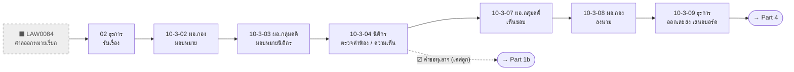

| # | Role | Page | Step | statusCode (from → to) | Inbox label (ก่อน → หลัง) | LAW index | Action (TH) | Next page / branch |
| --- | --- | --- | --- | --- | --- | --- | --- | --- |
| N1.0 | ศาลปกครอง (ภายนอก) | ⬛ ไม่มีหน้าจอ | LAW0084 | — | — | LAW0084* | ออกหมายเรียก ส่งสำเนาคำฟ้องให้ ป.ป.ท. | 1.1 |
| 1.1 | ธุรการกองกฎหมาย `admin_legal` | `02-board-intake.html` (category `10.3`, `div_courtCase`) | LAW0085 ธุรการ รับเรื่อง | (เคสใหม่) → `L3_PENDING_DIRECTOR_ASSIGN` | หลัง: «ผอ.กองกฎหมายพิจารณามอบหมาย» | LAW0085, 0086*, 0087* | รับหมายเรียก/สำเนาคำฟ้อง ลงทะเบียน เสนอ ผอ.กอง | 10-3-02 |
| 1.2 | ผอ.กองกฎหมาย `dir_legal` | `10-3-02-legal-director-assign.html` | LAW0088 | `L3_PENDING_DIRECTOR_ASSIGN` → `L3_PENDING_GROUP_ASSIGN` | ก่อน: «ผอ.กองกฎหมายพิจารณามอบหมาย»<br>หลัง: «ผอ.กลุ่มงานพิจารณามอบหมายนิติกร» | LAW0088 | ลงนามมอบหมาย | 10-3-03 |
| 1.3 | ผอ.กลุ่มงานคดี `case_group_director` | `10-3-03-group-director-assign.html` | LAW0089 | `L3_PENDING_GROUP_ASSIGN` → `L3_PENDING_LAWYER_REVIEW` | ก่อน: «ผอ.กลุ่มงานพิจารณามอบหมายนิติกร»<br>หลัง: «นิติกรตรวจสอบคำฟ้อง» | LAW0089 | มอบหมายนิติกรผู้รับผิดชอบ | 10-3-04 |
| 1.4 | นิติกร `case_legal_officer` | `10-3-04-lawyer-review-complaint.html` | LAW0090 | `L3_PENDING_LAWYER_REVIEW` → `L3_PENDING_GROUP_APPROVE` | ก่อน: «นิติกรตรวจสอบคำฟ้อง»<br>หลัง: «ผอ.กลุ่มงานพิจารณาเห็นชอบ» | LAW0090, 0092* | ตรวจคำฟ้อง + ค้นสำนวนเดิม + บันทึกความเห็น + ระบุว่ามีคำขอทุเลาฯ | 10-3-07 · ☑ ทุเลาฯ → สร้างเคสลูก → 10-3b-01 |
| 1.5 | ผอ.กลุ่มงานคดี `case_group_director` | `10-3-07-group-director-approve.html` | LAW0093 | `L3_PENDING_GROUP_APPROVE` → `L3_PENDING_DIRECTOR_SIGN` | ก่อน: «ผอ.กลุ่มงานพิจารณาเห็นชอบ»<br>หลัง: «ผอ.กองกฎหมายลงนามผ่านเรื่อง» | LAW0093 | พิจารณาเห็นชอบ | 10-3-08 |
| 1.6 | ผอ.กองกฎหมาย `dir_legal` | `10-3-08-legal-director-sign.html` | LAW0094 | `L3_PENDING_DIRECTOR_SIGN` → `L3_PENDING_ADMIN_DISPATCH` | ก่อน: «ผอ.กองกฎหมายลงนามผ่านเรื่อง»<br>หลัง: «ธุรการออกเลขส่งและเสนอบอร์ด» | LAW0094 | ตรวจสอบ ลงนามผ่านเรื่อง | 10-3-09 |
| 1.7 | ธุรการกองกฎหมาย `admin_legal` | `10-3-09-legal-admin-dispatch.html` | LAW0095 | `L3_PENDING_ADMIN_DISPATCH` → `L3_READY_FOR_BOARD` | ก่อน: «ธุรการออกเลขส่งและเสนอบอร์ด»<br>หลัง: «รอเสนอบอร์ด» | LAW0095, 0096* | ออกเลขส่งภายใน + ส่งมติเสนอบอร์ด | 10-3-10 (Part 4 — route อัตโนมัติ) |

## Part 1b / 2 — คำชี้แจงคัดค้านคำขอทุเลาการบังคับคดี (LAW0097–0099) · เคสลูก `<id>-B/yyyy`

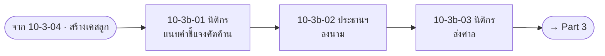

| # | Role | Page | Step | statusCode (from → to) | Inbox label (ก่อน → หลัง) | LAW index | Action (TH) | Next page / branch |
| --- | --- | --- | --- | --- | --- | --- | --- | --- |
| 1b.1 | นิติกร `case_legal_officer` | `10-3b-01-lawyer-draft-stay-objection.html` | LAW0097 | `L3B_PENDING_LAWYER_DRAFT` (สร้างโดย `spawnStayObjectionCase`) → `L3B_PENDING_CHAIRMAN_SIGN` | ก่อน: «นิติกรจัดทำคำชี้แจงคัดค้าน»<br>หลัง: «ประธานกรรมการ ป.ป.ท. ลงนามคำชี้แจงคัดค้าน» | LAW0097 | แนบคำชี้แจงคัดค้านฯ + เลือกศาล | 10-3b-02 |
| 1b.2 | ประธานกรรมการ ป.ป.ท. `chairman` | `10-3b-02-chairman-sign-stay-objection.html` | LAW0098 | `L3B_PENDING_CHAIRMAN_SIGN` → `L3B_PENDING_LAWYER_DISPATCH` | ก่อน: «ประธานกรรมการ ป.ป.ท. ลงนามคำชี้แจงคัดค้าน»<br>หลัง: «นิติกรส่งคำชี้แจงต่อศาล» | LAW0098 | ลงนามคำชี้แจงคัดค้าน | 10-3b-03 |
| 1b.3 | นิติกร `case_legal_officer` | `10-3b-03-lawyer-dispatch-stay-objection.html` | LAW0099 | `L3B_PENDING_LAWYER_DISPATCH` → `L3B_CLOSED` | ก่อน: «นิติกรส่งคำชี้แจงต่อศาล»<br>หลัง: «ส่งคำชี้แจงคัดค้านต่อศาลแล้ว» | LAW0099 | ส่งคำชี้แจงต่อศาล (นำส่งเอง / ไปรษณีย์) + ลงนาม | 10-3b-04 (Part 3) |

## Part 3 — คำสั่งศาลเรื่องทุเลาการบังคับคดี (LAW0100–0102) · เคสลูกเดียวกัน

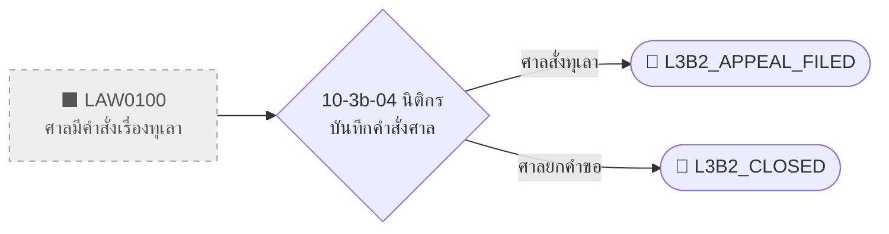

| # | Role | Page | Step | statusCode (from → to) | Inbox label (ก่อน → หลัง) | LAW index | Action (TH) | Next page / branch |
| --- | --- | --- | --- | --- | --- | --- | --- | --- |
| N3.0 | ศาลปกครอง (ภายนอก) | ⬛ ไม่มีหน้าจอ | LAW0100 (decision) | `L3B_CLOSED` (รอคำสั่งศาล) | ก่อน: «ส่งคำชี้แจงคัดค้านต่อศาลแล้ว» | LAW0100* | มีคำสั่งเรื่องทุเลาการบังคับคดี — ทุเลา หรือ ยกคำขอ | 3.1 |
| 3.1 | นิติกร `case_legal_officer` | `10-3b-04-lawyer-court-order-intake.html` | LAW0100_0101 | `L3B_CLOSED` → `L3B2_APPEAL_FILED` (ศาลสั่งทุเลา — แนบคำอุทธรณ์ + ลงนาม) / → `L3B2_CLOSED` (ศาลยกคำขอ — ยืนยัน) | ก่อน: «ส่งคำชี้แจงคัดค้านต่อศาลแล้ว»<br>หลัง: «จัดทำคำอุทธรณ์คัดค้านคำสั่งศาลแล้ว» / «ยุติส่วนคำขอทุเลา (รอผลคดีหลัก)» | LAW0100, 0101, 0102* (สาขายกคำขอ) | บันทึกคำสั่งศาล แยก 2 ทาง | 🏁 terminal ทั้ง 2 ทาง |

## Part 4 — จัดทำคำให้การแก้คำฟ้อง (LAW0103–0115) · หน้าใช้ step code ภายใน L3-19 … L3-33 → LAW ทุกตัวเป็นการอนุมาน

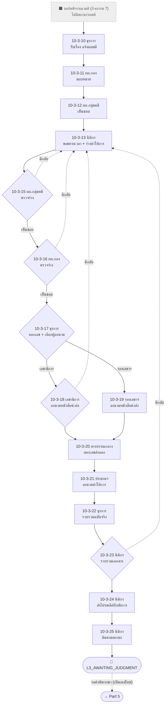

| # | Role | Page | Step | statusCode (from → to) | Inbox label (ก่อน → หลัง) | LAW index | Action (TH) | Next page / branch |
| --- | --- | --- | --- | --- | --- | --- | --- | --- |
| N4.0 | คณะกรรมการ ป.ป.ท. (บอร์ด) — กิจกรรมที่ 7 | ⬛ ไม่มีหน้าจอ | — | `L3_READY_FOR_BOARD` (ไม่มีสถานะรอมติ — route ตรงไป 10-3-10) | ก่อน: «รอเสนอบอร์ด» | — | บอร์ดพิจารณามติเรื่องคำฟ้อง | 4.1 |
| 4.1 | ธุรการกองกฎหมาย `admin_legal` | `10-3-10-legal-admin-resolution-notice.html` | L3-19 | `L3_READY_FOR_BOARD` → `L3_PENDING_DIRECTOR_RESOLUTION_ASSIGN` | ก่อน: «รอเสนอบอร์ด»<br>หลัง: «ผอ.กองกฎหมายพิจารณาและมอบหมายงาน» | LAW0103* (AS-IS = นิติกร) | รับเรื่อง แจ้งผลมติคณะกรรมการ ป.ป.ท. | 10-3-11 |
| 4.2 | ผอ.กองกฎหมาย `dir_legal` | `10-3-11-legal-director-assign-resolution.html` | L3-20 | → `L3_PENDING_GROUP_RESOLUTION_APPROVE` | ก่อน: «ผอ.กองกฎหมายพิจารณาและมอบหมายงาน»<br>หลัง: «ผอ.กลุ่มงานคดีพิจารณาเห็นชอบ» | LAW0105* | พิจารณาผลมติ มอบหมายงาน | 10-3-12 |
| 4.3 | ผอ.กลุ่มงานคดี `case_group_director` | `10-3-12-group-director-approve-resolution.html` | L3-21 | → `L3_PENDING_LAWYER_EXTENSION` | ก่อน: «ผอ.กลุ่มงานคดีพิจารณาเห็นชอบ»<br>หลัง: «นิติกรยื่นคำขอขยายเวลาต่อศาล» | LAW0104* + (เพิ่ม) | เห็นชอบผลมติ/ข้อสั่งการ | 10-3-13 |
| 4.4 | นิติกร `case_legal_officer` | `10-3-13-lawyer-request-extension.html` | L3-22 | → `L3_PENDING_GROUP_ANSWER_REVIEW` | ก่อน: «นิติกรยื่นคำขอขยายเวลาต่อศาล» (ถ้าถูกส่งกลับ: «นิติกรยื่นคำขอขยายเวลาต่อศาล»)<br>หลัง: «ผอ.กลุ่มงานคดีตรวจสอบร่างคำให้การ» | LAW0106*, 0107* | ยื่นขอขยายเวลา + ร่างคำให้การแก้คำฟ้อง | 10-3-15 · (ทุกการตีกลับใน Part 4 กลับมาหน้านี้) |
| 4.5 | ผอ.กลุ่มงานคดี `case_group_director` | `10-3-15-group-director-review-answer.html` | L3-24 | → `L3_PENDING_DIRECTOR_ANSWER_REVIEW` (เห็นชอบ) / → `L3_PENDING_LAWYER_EXTENSION` (ตีกลับ) | ก่อน: «ผอ.กลุ่มงานคดีตรวจสอบร่างคำให้การ»<br>หลัง: «ผอ.กองกฎหมายตรวจสอบร่างคำให้การ» / «นิติกรยื่นคำขอขยายเวลาต่อศาล» | LAW0108* | ตรวจร่างคำให้การ + หนังสือนำส่ง + ลงนาม | ✔ 10-3-16 · ✘ กลับ 10-3-13 |
| 4.6 | ผอ.กองกฎหมาย `dir_legal` | `10-3-16-legal-director-review-answer.html` | L3-25 | → `L3_PENDING_ADMIN_ANSWER_INTERNAL_NO` / → `L3_PENDING_LAWYER_EXTENSION` (ตีกลับ) | ก่อน: «ผอ.กองกฎหมายตรวจสอบร่างคำให้การ»<br>หลัง: «ธุรการออกเลขหนังสือส่งภายใน» / «นิติกรยื่นคำขอขยายเวลาต่อศาล» | LAW0109* | ตรวจร่างคำให้การ | ✔ 10-3-17 · ✘ กลับ 10-3-13 |
| 4.7 | ธุรการกองกฎหมาย `admin_legal` | `10-3-17-legal-admin-internal-dispatch-answer.html` | L3-26 | → `L3_PENDING_SECGEN_COVER_SIGN` หรือ `L3_PENDING_DEPUTY_SG_COVER_SIGN` | ก่อน: «ธุรการออกเลขหนังสือส่งภายใน»<br>หลัง: «เลขาธิการ ป.ป.ท. ตรวจคำให้การและลงนามหนังสือนำส่ง» / «รองเลขาธิการ ป.ป.ท. (ปฏิบัติราชการแทน) ตรวจคำให้การและลงนามหนังสือนำส่ง» | LAW0110* | ออกเลขส่งภายใน + เลือกผู้ลงนาม | 🔀 10-3-18 (เลขาฯ) / 10-3-19 (รองเลขาฯ) |
| 4.8a | เลขาธิการ `secgen` | `10-3-18-secgen-sign-cover-letter.html` | L3-27A | `L3_PENDING_SECGEN_COVER_SIGN` → `L3_PENDING_REGISTRY_ANSWER_EXTERNAL_NO` / → `L3_PENDING_LAWYER_EXTENSION` (ตีกลับ) | ก่อน: «เลขาธิการ ป.ป.ท. ตรวจคำให้การและลงนามหนังสือนำส่ง»<br>หลัง: «สารบรรณกลางออกเลขหนังสือส่งออก» / «นิติกรยื่นคำขอขยายเวลาต่อศาล» | LAW0111* | ตรวจคำให้การ ลงนามหนังสือนำส่ง | ✔ 10-3-20 · ✘ กลับ 10-3-13 |
| 4.8b | รองเลขาธิการ `deputy_sg` | `10-3-19-deputy-sg-sign-cover-letter.html` | L3-27B | `L3_PENDING_DEPUTY_SG_COVER_SIGN` → `L3_PENDING_REGISTRY_ANSWER_EXTERNAL_NO` | ก่อน: «รองเลขาธิการ ป.ป.ท. (ปฏิบัติราชการแทน) ตรวจคำให้การและลงนามหนังสือนำส่ง»<br>หลัง: «สารบรรณกลางออกเลขหนังสือส่งออก» | LAW0111* | ลงนามหนังสือนำส่ง (ปฏิบัติราชการแทน) | 10-3-20 (⚠ ไม่มีตีกลับ ต่างจาก 18) |
| 4.9 | สารบรรณกลาง `registry` | `10-3-20-registry-issue-external-no.html` | L3-28 | → `L3_PENDING_CHAIRMAN_ANSWER_SIGN` | ก่อน: «สารบรรณกลางออกเลขหนังสือส่งออก»<br>หลัง: «ประธานกรรมการ ป.ป.ท. ลงนามในคำให้การ» | LAW0112* | ออกเลขหนังสือส่งออก | 10-3-21 |
| 4.10 | ประธานกรรมการ `chairman` | `10-3-21-chairman-sign-answer.html` | L3-29 | → `L3_PENDING_ADMIN_COLLECT_ORIGINALS` | ก่อน: «ประธานกรรมการ ป.ป.ท. ลงนามในคำให้การ»<br>หลัง: «ธุรการกองกฎหมายรวบรวมเอกสารฉบับจริงที่ลงนามครบถ้วน» | LAW0113* | ลงนามคำให้การแก้คำฟ้อง | 10-3-22 |
| 4.11 | ธุรการกองกฎหมาย `admin_legal` | `10-3-22-legal-admin-collect-originals.html` | L3-30 | → `L3_PENDING_LAWYER_COLLECT_DOCS` | ก่อน: «ธุรการกองกฎหมายรวบรวมเอกสารฉบับจริงที่ลงนามครบถ้วน»<br>หลัง: «นิติกรรวบรวมร่างคำให้การและเอกสารที่เกี่ยวข้อง» | LAW0114* (บางส่วน — ไม่ชัด) | รวบรวมเอกสารฉบับจริงที่ลงนามครบ | 10-3-23 |
| 4.12 | นิติกร `case_legal_officer` | `10-3-23-lawyer-collect-documents.html` | L3-31 | → `L3_PENDING_LAWYER_POST_TO_PROSECUTOR` / → `L3_PENDING_LAWYER_EXTENSION` (ตีกลับ) | ก่อน: «นิติกรรวบรวมร่างคำให้การและเอกสารที่เกี่ยวข้อง»<br>หลัง: «นิติกรจัดส่งทางไปรษณีย์ไปยังสำนักงานคดีปกครอง» / «นิติกรยื่นคำขอขยายเวลาต่อศาล» | LAW0114* | ตรวจ/เรียงชุดเอกสารก่อนส่ง | ✔ 10-3-24 · ✘ กลับ 10-3-13 |
| 4.13 | นิติกร `case_legal_officer` | `10-3-24-lawyer-post-to-prosecutor.html` | L3-32 | → `L3_PENDING_LAWYER_TRACK_STATUS` | ก่อน: «นิติกรจัดส่งทางไปรษณีย์ไปยังสำนักงานคดีปกครอง»<br>หลัง: «นิติกรติดตามสถานะการจัดส่งและใบตอบรับ» | LAW0115* | ส่งไปรษณีย์ถึงสำนักงานคดีปกครอง | 10-3-25 |
| 4.14 | นิติกร `case_legal_officer` | `10-3-25-lawyer-track-status.html` | L3-33 | → `L3_AWAITING_JUDGMENT` | ก่อน: «นิติกรติดตามสถานะการจัดส่งและใบตอบรับ»<br>หลัง: «ส่งคำให้การแล้ว รอศาลปกครองมีคำพิพากษา» | — (เพิ่ม) | ติดตามสถานะ/ใบตอบรับ | 🏁 terminal (Part 5 ไม่ต่อจากเคสนี้) |

## Part 5 — รับคำพิพากษาศาลปกครองชั้นต้น (LAW0116–0123) · เคสใหม่ `l3CaseType: "verdict"`

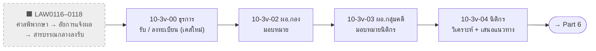

| # | Role | Page | Step | statusCode (from → to) | Inbox label (ก่อน → หลัง) | LAW index | Action (TH) | Next page / branch |
| --- | --- | --- | --- | --- | --- | --- | --- | --- |
| N5.a | ศาลปกครอง (ภายนอก) | ⬛ ไม่มีหน้าจอ | LAW0116 | — | — | LAW0116* | มีคำพิพากษา (ศาลปกครองชั้นต้น) | N5.b |
| N5.b | สำนักงานคดีปกครอง (อัยการ) | ⬛ ไม่มีหน้าจอ | LAW0117 | — | — | LAW0117* | มีหนังสือแจ้งผลคำพิพากษาศาลปกครองชั้นต้นมาที่ ป.ป.ท. | N5.c |
| N5.c | สารบรรณกลาง | ⬛ ไม่มีหน้าจอ | LAW0118 | — | — | LAW0118* | ลงทะเบียนรับเรื่อง ส่งกองกฎหมาย | 5.1 |
| 5.1 | ธุรการกองกฎหมาย `admin_legal` | `10-3v-00-legal-admin-verdict-intake.html` | LAW0119 | (เคสใหม่ `addCase`) → `L3V_PENDING_DIRECTOR_ASSIGN` | หลัง: «ผอ.กองกฎหมายพิจารณามอบหมาย (คำพิพากษา)» | LAW0119, 0120 | รับหนังสือแจ้งผลคำพิพากษา ลงทะเบียน + เชื่อมกับเรื่องคำฟ้องเดิม | 10-3v-02 |
| 5.2 | ผอ.กองกฎหมาย `dir_legal` | `10-3v-02-legal-director-assign.html` | LAW0121 | → `L3V_PENDING_GROUP_ASSIGN` | ก่อน: «ผอ.กองกฎหมายพิจารณามอบหมาย (คำพิพากษา)»<br>หลัง: «ผอ.กลุ่มงานพิจารณามอบหมายนิติกร (คำพิพากษา)» | LAW0121 | แจกจ่าย/มอบหมาย + ลงนาม | 10-3v-03 |
| 5.3 | ผอ.กลุ่มงานคดี `case_group_director` | `10-3v-03-group-director-assign.html` | LAW0122 | → `L3V_PENDING_LAWYER_ANALYSIS` | ก่อน: «ผอ.กลุ่มงานพิจารณามอบหมายนิติกร (คำพิพากษา)»<br>หลัง: «นิติกรวิเคราะห์ผลคำพิพากษา» | LAW0122 | มอบหมายนิติกร + ลงนาม | 10-3v-04 |
| 5.4 | นิติกร `case_legal_officer` | `10-3v-04-lawyer-verdict-analysis.html` | LAW0123 | → `L3V_PENDING_GROUP_APPROVE` (บันทึก `l3ProposedBranch`) | ก่อน: «นิติกรวิเคราะห์ผลคำพิพากษา»<br>หลัง: «ผอ.กลุ่มงานพิจารณาเห็นชอบ (คำพิพากษา)»<br>＋ B1 | LAW0123, 0124*, 0125* | ตรวจคำพิพากษา บันทึกผลคดี วิเคราะห์ + เสนอแนวทาง | 10-3v-05 |

## Part 6 — วิเคราะห์ผลคำพิพากษา → กำหนดแนวทาง (LAW0124–0128)

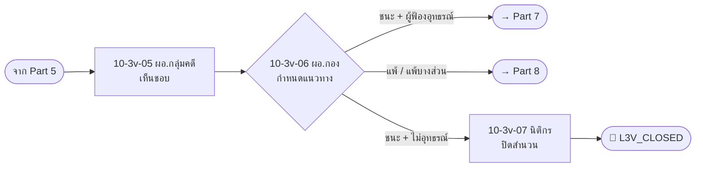

| # | Role | Page | Step | statusCode (from → to) | Inbox label (ก่อน → หลัง) | LAW index | Action (TH) | Next page / branch |
| --- | --- | --- | --- | --- | --- | --- | --- | --- |
| 6.1 | ผอ.กลุ่มงานคดี `case_group_director` | `10-3v-05-group-director-approve.html` | LAW0126 | `L3V_PENDING_GROUP_APPROVE` → `L3V_PENDING_DIRECTOR_DECIDE` | ก่อน: «ผอ.กลุ่มงานพิจารณาเห็นชอบ (คำพิพากษา)»<br>หลัง: «ผอ.กองกฎหมายกำหนดแนวทาง (คำพิพากษา)»<br>＋ B1 | LAW0126 | พิจารณาเห็นชอบ | 10-3v-06 |
| 6.2 | ผอ.กองกฎหมาย `dir_legal` | `10-3v-06-legal-director-decide.html` | LAW0127 | → `L3V_TO_APPEAL_REPLY` (ชนะ + ผู้ฟ้องอุทธรณ์) / → `L3V_TO_APPEAL_CONSIDER` (แพ้/แพ้บางส่วน) / → `L3V_TO_CLOSE` (ชนะ + ไม่อุทธรณ์) | ก่อน: «ผอ.กองกฎหมายกำหนดแนวทาง (คำพิพากษา)»<br>หลัง: «รอจัดทำคำแก้อุทธรณ์» / «รอพิจารณาความเห็นควรอุทธรณ์» / «รอปิดสำนวน (LAW0163)»<br>＋ B1 | LAW0127, 0128* | ยืนยัน/เปลี่ยนแนวทาง (เปลี่ยนต้องระบุเหตุผล) + ลงนาม | 🔀 10-3v-08 (Part 7) · 10-3v-16 (Part 8) · 10-3v-07 |
| 6.3 | นิติกร `case_legal_officer` | `10-3v-07-lawyer-close-case.html` | LAW0163 | `L3V_TO_CLOSE` → `L3V_CLOSED` | ก่อน: «รอปิดสำนวน (LAW0163)»<br>หลัง: «ปิดสำนวนคดีแล้ว»<br>＋ B1 | LAW0163 | ดำเนินการตามคำพิพากษา ปิดสำนวน | 🏁 terminal |

## Part 7 — จัดทำคำแก้อุทธรณ์ (LAW0129–0141)

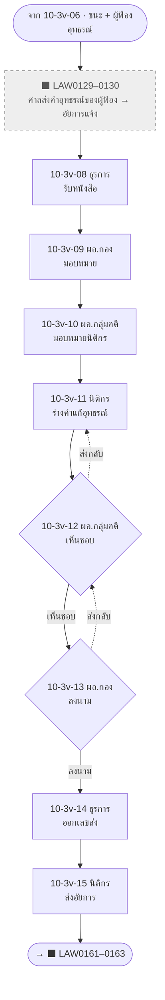

| # | Role | Page | Step | statusCode (from → to) | Inbox label (ก่อน → หลัง) | LAW index | Action (TH) | Next page / branch |
| --- | --- | --- | --- | --- | --- | --- | --- | --- |
| N7.a | ศาลปกครอง (ภายนอก) | ⬛ ไม่มีหน้าจอ | LAW0129 | `L3V_TO_APPEAL_REPLY` (รอหนังสือ) | ก่อน: «รอจัดทำคำแก้อุทธรณ์» | LAW0129* | ส่งสำเนาคำอุทธรณ์ของผู้ฟ้องคดีให้ ป.ป.ท. จัดทำคำแก้อุทธรณ์ | N7.b |
| N7.b | สำนักงานคดีปกครอง (อัยการ) | ⬛ ไม่มีหน้าจอ | LAW0130 | — | — | LAW0130* | มีหนังสือแจ้งคำสั่งศาลให้ทำคำแก้อุทธรณ์มาที่ ป.ป.ท. | 7.1 |
| 7.1 | ธุรการกองกฎหมาย `admin_legal` | `10-3v-08-legal-admin-appeal-intake.html` | LAW0131 | `L3V_TO_APPEAL_REPLY` → `L7_PENDING_DIRECTOR_ASSIGN` | ก่อน: «รอจัดทำคำแก้อุทธรณ์»<br>หลัง: «ผอ.กองกฎหมายพิจารณามอบหมาย (คำแก้อุทธรณ์)»<br>＋ B1 | LAW0131, 0132* | รับหนังสือแจ้งคำสั่งศาลให้ทำคำแก้อุทธรณ์ | 10-3v-09 |
| 7.2 | ผอ.กองกฎหมาย `dir_legal` | `10-3v-09-legal-director-assign.html` | LAW0135 | → `L7_PENDING_GROUP_ASSIGN` | ก่อน: «ผอ.กองกฎหมายพิจารณามอบหมาย (คำแก้อุทธรณ์)»<br>หลัง: «ผอ.กลุ่มงานพิจารณามอบหมายนิติกร (คำแก้อุทธรณ์)»<br>＋ B1 | LAW0135 | แจกจ่าย/มอบหมาย | 10-3v-10 |
| 7.3 | ผอ.กลุ่มงานคดี `case_group_director` | `10-3v-10-group-director-assign.html` | L7ASSIGN | → `L7_PENDING_LAWYER_DRAFT` | ก่อน: «ผอ.กลุ่มงานพิจารณามอบหมายนิติกร (คำแก้อุทธรณ์)»<br>หลัง: «นิติกรร่างคำแก้อุทธรณ์»<br>＋ B1 | — (เพิ่ม) | มอบหมายนิติกร | 10-3v-11 |
| 7.4 | นิติกร `case_legal_officer` | `10-3v-11-lawyer-draft-appeal-reply.html` | LAW0133 | → `L7_PENDING_GROUP_APPROVE` | ก่อน: «นิติกรร่างคำแก้อุทธรณ์» (ถ้าถูกส่งกลับ: «นิติกรแก้ไขร่างคำแก้อุทธรณ์ (ส่งกลับแก้ไข)»)<br>หลัง: «ผอ.กลุ่มงานตรวจร่างคำแก้อุทธรณ์»<br>＋ B1 | LAW0133, 0136*, 0137* | ลงทะเบียนคดี ศึกษาคำอุทธรณ์ ร่างคำแก้อุทธรณ์ | 10-3v-12 |
| 7.5 | ผอ.กลุ่มงานคดี `case_group_director` | `10-3v-12-group-director-approve.html` | LAW0134 | → `L7_PENDING_DIRECTOR_SIGN` / → `L7_PENDING_LAWYER_DRAFT` (ส่งกลับ) | ก่อน: «ผอ.กลุ่มงานตรวจร่างคำแก้อุทธรณ์» (ถ้าถูกส่งกลับ: «ผอ.กลุ่มงานคดีทบทวนร่างคำแก้อุทธรณ์ (ส่งกลับทบทวน)»)<br>หลัง: «ผอ.กองกฎหมายพิจารณาและลงนาม (คำแก้อุทธรณ์)» / «นิติกรแก้ไขร่างคำแก้อุทธรณ์ (ส่งกลับแก้ไข)»<br>＋ B1 | LAW0134, 0138 | ตรวจร่างและเห็นชอบ | ✔ 10-3v-13 · ✘ กลับ 10-3v-11 |
| 7.6 | ผอ.กองกฎหมาย `dir_legal` | `10-3v-13-legal-director-sign.html` | LAW0139 | → `L7_PENDING_ADMIN_DISPATCH` / → `L7_PENDING_GROUP_APPROVE` (ส่งกลับ) | ก่อน: «ผอ.กองกฎหมายพิจารณาและลงนาม (คำแก้อุทธรณ์)»<br>หลัง: «ธุรการออกเลขส่งคำแก้อุทธรณ์» / «ผอ.กลุ่มงานคดีทบทวนร่างคำแก้อุทธรณ์ (ส่งกลับทบทวน)»<br>＋ B1 | LAW0139 | ลงนามคำแก้อุทธรณ์ + หนังสือ | ✔ 10-3v-14 · ✘ กลับ 10-3v-12 |
| 7.7 | ธุรการกองกฎหมาย `admin_legal` | `10-3v-14-legal-admin-dispatch.html` | LAW0140 | → `L7_PENDING_LAWYER_SEND` | ก่อน: «ธุรการออกเลขส่งคำแก้อุทธรณ์»<br>หลัง: «นิติกรส่งคำแก้อุทธรณ์ไปสำนักงานคดีปกครอง»<br>＋ B1 | LAW0140 | ออกเลขหนังสือส่งภายนอก | 10-3v-15 |
| 7.8 | นิติกร `case_legal_officer` | `10-3v-15-lawyer-send-appeal-reply.html` | LAW0141 | → `L7_SENT_TO_PROSECUTOR` | ก่อน: «นิติกรส่งคำแก้อุทธรณ์ไปสำนักงานคดีปกครอง»<br>หลัง: «ส่งคำแก้อุทธรณ์ไปสำนักงานคดีปกครองแล้ว»<br>＋ B1 | LAW0141 | ส่งคำแก้อุทธรณ์ไปสำนักงานคดีปกครอง | 🏁 terminal (LAW0161 ไม่ได้สร้าง) |

## Part 8 — พิจารณาความเห็นควรอุทธรณ์ (LAW0142–0148)

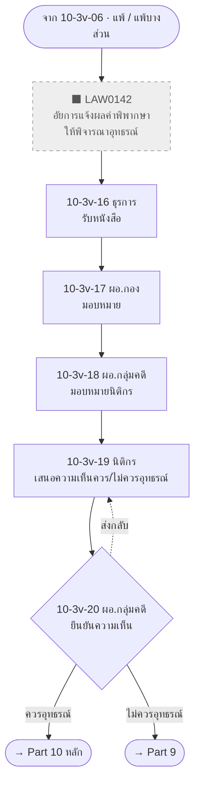

| # | Role | Page | Step | statusCode (from → to) | Inbox label (ก่อน → หลัง) | LAW index | Action (TH) | Next page / branch |
| --- | --- | --- | --- | --- | --- | --- | --- | --- |
| N8.a | สำนักงานคดีปกครอง (อัยการ) | ⬛ ไม่มีหน้าจอ | LAW0142 | `L3V_TO_APPEAL_CONSIDER` (รอหนังสือ) | ก่อน: «รอพิจารณาความเห็นควรอุทธรณ์» | LAW0142* | มีหนังสือแจ้งผลคำพิพากษาเพื่อให้ ป.ป.ท. พิจารณาว่าจะอุทธรณ์หรือไม่ | 8.1 |
| 8.1 | ธุรการกองกฎหมาย `admin_legal` | `10-3v-16-legal-admin-appeal-consider-intake.html` | LAW0143 | `L3V_TO_APPEAL_CONSIDER` → `L8_PENDING_DIRECTOR_ASSIGN1` | ก่อน: «รอพิจารณาความเห็นควรอุทธรณ์»<br>หลัง: «ผอ.กองกฎหมายพิจารณามอบหมาย (ความเห็นควรอุทธรณ์)»<br>＋ B1 | LAW0143, 0144* | รับหนังสือแจ้งผลคำพิพากษาเพื่อพิจารณาอุทธรณ์ | 10-3v-17 |
| 8.2 | ผอ.กองกฎหมาย `dir_legal` | `10-3v-17-legal-director-assign1.html` | L8ASSIGN1 | → `L8_PENDING_GROUP_ASSIGN1` | ก่อน: «ผอ.กองกฎหมายพิจารณามอบหมาย (ความเห็นควรอุทธรณ์)»<br>หลัง: «ผอ.กลุ่มงานพิจารณามอบหมายนิติกรลงทะเบียน»<br>＋ B1 | — (เพิ่ม) | มอบหมาย ผอ.กลุ่มงานคดี | 10-3v-18 |
| 8.3 | ผอ.กลุ่มงานคดี `case_group_director` | `10-3v-18-group-director-assign1.html` | L8GROUPASSIGN1 | → `L8_PENDING_LAWYER_REGISTER` | ก่อน: «ผอ.กลุ่มงานพิจารณามอบหมายนิติกรลงทะเบียน»<br>หลัง: «นิติกรลงทะเบียนคดีปกครอง»<br>＋ B1 | — (เพิ่ม) | มอบหมายนิติกร | 10-3v-19 |
| 8.4 | นิติกร `case_legal_officer` | `10-3v-19-lawyer-register.html` | LAW0145 | → `L8_PENDING_GROUP_APPROVE1` (บันทึก `l8ProposedBranch` = APPEAL / BOARD) | ก่อน: «นิติกรลงทะเบียนคดีปกครอง» (ถ้าถูกส่งกลับ: «นิติกรทบทวนความเห็นควรอุทธรณ์ (ส่งกลับทบทวน)»)<br>หลัง: «ผอ.กลุ่มงานพิจารณาเห็นชอบการลงทะเบียน»<br>＋ B1 B2 | LAW0145, 0148* | ลงทะเบียน ตรวจคำพิพากษา เสนอความเห็นควร/ไม่ควรอุทธรณ์ + แนบร่างคำอุทธรณ์ หรือ บันทึกเสนอบอร์ด | 10-3v-20 |
| 8.5 | ผอ.กลุ่มงานคดี `case_group_director` | `10-3v-20-group-director-approve1.html` | LAW0146 | → `L8_TO_APPEAL_DRAFT` (ควรอุทธรณ์) / → `L8_TO_BOARD_PROPOSE` (ไม่ควรอุทธรณ์) / → `L8_PENDING_LAWYER_REGISTER` (ส่งกลับ) | ก่อน: «ผอ.กลุ่มงานพิจารณาเห็นชอบการลงทะเบียน»<br>หลัง: «รอจัดทำคำอุทธรณ์» / «รอเสนอมติอุทธรณ์ต่อบอร์ด» / «นิติกรทบทวนความเห็นควรอุทธรณ์ (ส่งกลับทบทวน)»<br>＋ B1 B2 | LAW0146 | ยืนยันความเห็นควรอุทธรณ์ | 🔀 10-3v-22 (Part 10) · 10-3v-26 (Part 9) · ✘ กลับ 10-3v-19 |

## Part 9 — เสนอมติ (ไม่) อุทธรณ์ต่อบอร์ด (LAW0149–0152)

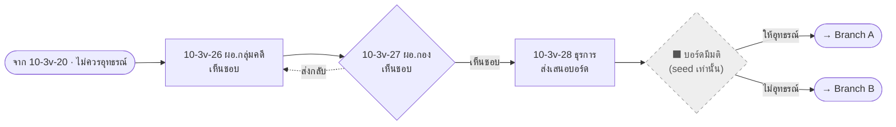

| # | Role | Page | Step | statusCode (from → to) | Inbox label (ก่อน → หลัง) | LAW index | Action (TH) | Next page / branch |
| --- | --- | --- | --- | --- | --- | --- | --- | --- |
| 9.1 | ผอ.กลุ่มงานคดี `case_group_director` | `10-3v-26-group-director-board-approve.html` | LAW0150 | `L8_TO_BOARD_PROPOSE` → `L9_PENDING_DIRECTOR_APPROVE` | ก่อน: «รอเสนอมติอุทธรณ์ต่อบอร์ด» (ถ้าถูกส่งกลับ: «ผอ.กลุ่มงานคดีทบทวนบันทึกเสนอบอร์ด (ส่งกลับทบทวน)»)<br>หลัง: «ผอ.กองกฎหมายพิจารณาและลงนามเห็นชอบ (เสนอมติบอร์ด)»<br>＋ B1 B2 «ผอ.กลุ่มงาน เห็นชอบ» | LAW0150 | ลงนามเห็นชอบเสนอมติบอร์ด | 10-3v-27 |
| 9.2 | ผอ.กองกฎหมาย `dir_legal` | `10-3v-27-legal-director-board-approve.html` | LAW0151 | → `L9_PENDING_DOC_SEND` / → `L8_TO_BOARD_PROPOSE` (ส่งกลับ) | ก่อน: «ผอ.กองกฎหมายพิจารณาและลงนามเห็นชอบ (เสนอมติบอร์ด)»<br>หลัง: «ธุรการกองกฎหมายส่งมติเสนอบอร์ด» / «ผอ.กลุ่มงานคดีทบทวนบันทึกเสนอบอร์ด (ส่งกลับทบทวน)»<br>＋ B1 B2 «ผอ.กองกฎหมาย เห็นชอบ» | LAW0151 | ลงนามเห็นชอบ | ✔ 10-3v-28 · ✘ กลับ 10-3v-26 |
| 9.3 | ธุรการกองกฎหมาย `admin_legal` | `10-3v-28-legal-admin-board-propose.html` | LAW0152 | → `L9_PROPOSED_TO_BOARD` | ก่อน: «ธุรการกองกฎหมายส่งมติเสนอบอร์ด»<br>หลัง: «เสนอมติอุทธรณ์ต่อบอร์ดแล้ว (รอบอร์ดพิจารณา)»<br>＋ B1 B2 «ธุรการ ส่งมติบอร์ด» | LAW0152 | ส่งมติเสนอบอร์ด | 🏁 terminal · ⬛ มติบอร์ด `L9_BOARD_APPROVED_APPEAL` / `_NO_APPEAL` มีเฉพาะใน seed |
| N9.x | คณะกรรมการ ป.ป.ท. (บอร์ด) | ⬛ ไม่มีหน้าจอ | — | `L9_PROPOSED_TO_BOARD` → `L9_BOARD_APPROVED_APPEAL` / `L9_BOARD_APPROVED_NO_APPEAL` (มีเฉพาะเคส seed — ไม่มีหน้าเขียน) | ก่อน: «เสนอมติอุทธรณ์ต่อบอร์ดแล้ว (รอบอร์ดพิจารณา)»<br>หลัง: «รอธุรการรับหนังสือแจ้งมติบอร์ดเห็นชอบให้อุทธรณ์» / «รอธุรการรับหนังสือแจ้งมติบอร์ดเห็นชอบไม่อุทธรณ์»<br>＋ B1 B2 | — | บอร์ดมีมติให้อุทธรณ์ หรือ ไม่อุทธรณ์ | A.1 (ให้อุทธรณ์) / B.1 (ไม่อุทธรณ์) |

## Part 10 (หลัก) — ดำเนินการอุทธรณ์ กรณีนิติกรเห็นควรอุทธรณ์ (LAW0157–0160)

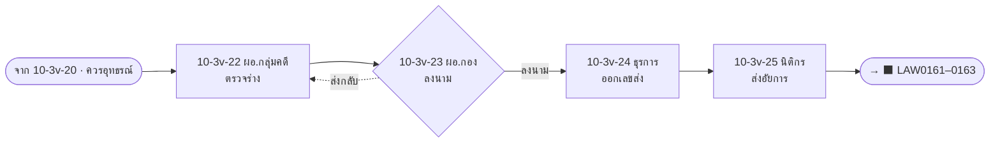

| # | Role | Page | Step | statusCode (from → to) | Inbox label (ก่อน → หลัง) | LAW index | Action (TH) | Next page / branch |
| --- | --- | --- | --- | --- | --- | --- | --- | --- |
| 10.1 | ผอ.กลุ่มงานคดี `case_group_director` | `10-3v-22-group-director-review-appeal.html` | LAW0157 | `L8_TO_APPEAL_DRAFT` → `L10_PENDING_DIRECTOR_SIGN` | ก่อน: «รอจัดทำคำอุทธรณ์» (ถ้าถูกส่งกลับ: «ผอ.กลุ่มงานคดีทบทวนร่างคำอุทธรณ์ (ส่งกลับทบทวน)»)<br>หลัง: «ผอ.กองกฎหมายพิจารณาและลงนามคำอุทธรณ์»<br>＋ B1 B2 «ผอ.กลุ่มงาน ตรวจร่าง» | LAW0157 | ตรวจร่างคำอุทธรณ์ | 10-3v-23 |
| 10.2 | ผอ.กองกฎหมาย `dir_legal` | `10-3v-23-legal-director-sign-appeal.html` | LAW0158 | → `L10_PENDING_DOC_NO` / → `L8_TO_APPEAL_DRAFT` (ส่งกลับ) | ก่อน: «ผอ.กองกฎหมายพิจารณาและลงนามคำอุทธรณ์»<br>หลัง: «ธุรการกองกฎหมายออกเลขหนังสือส่งภายนอก» / «ผอ.กลุ่มงานคดีทบทวนร่างคำอุทธรณ์ (ส่งกลับทบทวน)»<br>＋ B1 B2 «ผอ.กองกฎหมาย ลงนาม» | LAW0158 | ลงนามคำอุทธรณ์/หนังสือ | ✔ 10-3v-24 · ✘ กลับ 10-3v-22 |
| 10.3 | ธุรการกองกฎหมาย `admin_legal` | `10-3v-24-legal-admin-dispatch.html` | LAW0159 | → `L10_PENDING_LAWYER_SEND` | ก่อน: «ธุรการกองกฎหมายออกเลขหนังสือส่งภายนอก»<br>หลัง: «นิติกรจัดส่งหนังสือและคำอุทธรณ์ทางไปรษณีย์»<br>＋ B1 B2 «ธุรการ ออกเลขส่ง» | LAW0159 | ออกเลขหนังสือส่งภายนอก | 10-3v-25 |
| 10.4 | นิติกร `case_legal_officer` | `10-3v-25-lawyer-send-appeal.html` | LAW0160 | → `L10_SENT_TO_PROSECUTOR` | ก่อน: «นิติกรจัดส่งหนังสือและคำอุทธรณ์ทางไปรษณีย์»<br>หลัง: «จัดส่งคำอุทธรณ์ไปยังสำนักงานคดีปกครองแล้ว (รอยื่นต่อศาลปกครองสูงสุด)»<br>＋ B1 B2 «นิติกร ส่งคำอุทธรณ์» | LAW0160 | ส่งคำอุทธรณ์ไปสำนักงานคดีปกครอง | 🏁 terminal |

## Part 10 · Branch A — บอร์ดมีมติให้อุทธรณ์ (LAW0153–0160)

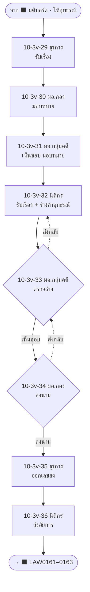

| # | Role | Page | Step | statusCode (from → to) | Inbox label (ก่อน → หลัง) | LAW index | Action (TH) | Next page / branch |
| --- | --- | --- | --- | --- | --- | --- | --- | --- |
| A.1 | ธุรการกองกฎหมาย `admin_legal` | `10-3v-29-legal-admin-board-appeal-intake.html` | L9A_INTAKE | `L9_BOARD_APPROVED_APPEAL` (seed) → `L9A_PENDING_DIRECTOR_ASSIGN` | ก่อน: «รอธุรการรับหนังสือแจ้งมติบอร์ดเห็นชอบให้อุทธรณ์»<br>หลัง: «ผอ.กองกฎหมายพิจารณาและมอบหมายงาน (ดำเนินการอุทธรณ์)»<br>＋ B1 B2 B3 «ธุรการ รับเรื่อง» | — (เพิ่ม) | รับหนังสือแจ้งมติบอร์ดให้อุทธรณ์ | 10-3v-30 |
| A.2 | ผอ.กองกฎหมาย `dir_legal` | `10-3v-30-legal-director-assign2.html` | LAW0155 | → `L9A_PENDING_GROUP_APPROVE` | ก่อน: «ผอ.กองกฎหมายพิจารณาและมอบหมายงาน (ดำเนินการอุทธรณ์)»<br>หลัง: «ผอ.กลุ่มงานคดีพิจารณาและเห็นชอบ (ดำเนินการอุทธรณ์)»<br>＋ B1 B2 B3 «ผอ.กองกฎหมาย มอบหมาย» | LAW0155 | พิจารณาและมอบหมาย + ลงนาม | 10-3v-31 |
| A.3 | ผอ.กลุ่มงานคดี `case_group_director` | `10-3v-31-group-director-assign2.html` | LAW0154 | → `L9A_PENDING_LAWYER_DRAFT` | ก่อน: «ผอ.กลุ่มงานคดีพิจารณาและเห็นชอบ (ดำเนินการอุทธรณ์)»<br>หลัง: «นิติกรรับเรื่องเพื่อดำเนินการแจ้งผลและร่างคำอุทธรณ์»<br>＋ B1 B2 B3 «ผอ.กลุ่มงาน เห็นชอบ/มอบหมาย» | LAW0154 + (เพิ่ม) | เห็นชอบและมอบหมายนิติกร | 10-3v-32 |
| A.4 | นิติกร `case_legal_officer` | `10-3v-32-lawyer-draft-appeal2.html` | LAW0153_0156 | → `L9A_PENDING_GROUP_REVIEW` | ก่อน: «นิติกรรับเรื่องเพื่อดำเนินการแจ้งผลและร่างคำอุทธรณ์» (ถ้าถูกส่งกลับ: «นิติกรแก้ไขร่างคำอุทธรณ์ (ส่งกลับทบทวน)»)<br>หลัง: «ผอ.กลุ่มงานคดีตรวจร่างคำอุทธรณ์»<br>＋ B1 B2 B3 «นิติกร รับเรื่อง/ร่าง» | LAW0153, 0156 | รับเรื่อง + ร่างคำอุทธรณ์ (แนบไฟล์) | 10-3v-33 |
| A.5 | ผอ.กลุ่มงานคดี `case_group_director` | `10-3v-33-group-director-review-appeal2.html` | LAW0157B | → `L9A_PENDING_DIRECTOR_SIGN` / → `L9A_PENDING_LAWYER_DRAFT` (ส่งกลับ) | ก่อน: «ผอ.กลุ่มงานคดีตรวจร่างคำอุทธรณ์» (ถ้าถูกส่งกลับ: «ผอ.กลุ่มงานคดีทบทวนร่างคำอุทธรณ์ (ส่งกลับทบทวน)»)<br>หลัง: «ผอ.กองกฎหมายพิจารณาและลงนามคำอุทธรณ์» / «นิติกรแก้ไขร่างคำอุทธรณ์ (ส่งกลับทบทวน)»<br>＋ B1 B2 B3 «ผอ.กลุ่มงาน ตรวจร่าง» «ผอ.กลุ่มงาน เห็นชอบ/มอบหมาย» | LAW0157 | ตรวจร่างคำอุทธรณ์ | ✔ 10-3v-34 · ✘ กลับ 10-3v-32 |
| A.6 | ผอ.กองกฎหมาย `dir_legal` | `10-3v-34-legal-director-sign-appeal2.html` | LAW0158B | → `L9A_PENDING_DOC_NO` / → `L9A_PENDING_GROUP_REVIEW` (ส่งกลับ) | ก่อน: «ผอ.กองกฎหมายพิจารณาและลงนามคำอุทธรณ์»<br>หลัง: «ธุรการกองกฎหมายออกเลขหนังสือส่งภายนอก (สายมติบอร์ด)» / «ผอ.กลุ่มงานคดีทบทวนร่างคำอุทธรณ์ (ส่งกลับทบทวน)»<br>＋ B1 B2 B3 «ผอ.กองกฎหมาย ลงนาม» «นิติกร รับเรื่อง/ร่าง» | LAW0158 | ลงนามคำอุทธรณ์/หนังสือ | ✔ 10-3v-35 · ✘ กลับ 10-3v-33 |
| A.7 | ธุรการกองกฎหมาย `admin_legal` | `10-3v-35-legal-admin-dispatch2.html` | LAW0159B | → `L9A_PENDING_LAWYER_SEND` | ก่อน: «ธุรการกองกฎหมายออกเลขหนังสือส่งภายนอก (สายมติบอร์ด)»<br>หลัง: «นิติกรจัดส่งหนังสือและคำอุทธรณ์ทางไปรษณีย์ (สายมติบอร์ด)»<br>＋ B1 B2 B3 «ธุรการ ออกเลขส่ง» | LAW0159 | ออกเลขหนังสือส่งภายนอก | 10-3v-36 |
| A.8 | นิติกร `case_legal_officer` | `10-3v-36-lawyer-send-appeal2.html` | LAW0160B | → `L9A_SENT_TO_PROSECUTOR` | ก่อน: «นิติกรจัดส่งหนังสือและคำอุทธรณ์ทางไปรษณีย์ (สายมติบอร์ด)»<br>หลัง: «จัดส่งคำอุทธรณ์ไปยังสำนักงานคดีปกครองแล้ว (รอยื่นต่อศาลปกครองสูงสุด)»<br>＋ B1 B2 B3 «นิติกร ส่งคำอุทธรณ์» | LAW0160 | ส่งคำอุทธรณ์ไปสำนักงานคดีปกครอง | 🏁 terminal |

## Part 11 · Branch B — บอร์ดมีมติไม่อุทธรณ์ → แจ้งความประสงค์ไม่อุทธรณ์ (LAW0164–0171, 0163)

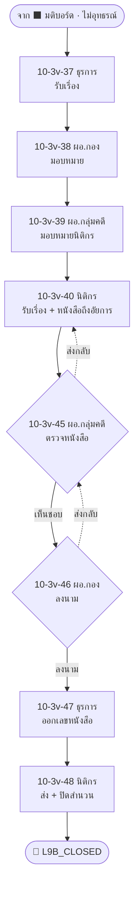

| # | Role | Page | Step | statusCode (from → to) | Inbox label (ก่อน → หลัง) | LAW index | Action (TH) | Next page / branch |
| --- | --- | --- | --- | --- | --- | --- | --- | --- |
| B.1 | ธุรการกองกฎหมาย `admin_legal` | `10-3v-37-legal-admin-no-appeal-intake.html` | L9B_INTAKE | `L9_BOARD_APPROVED_NO_APPEAL` (seed) → `L9B_PENDING_DIRECTOR_ASSIGN1` | ก่อน: «รอธุรการรับหนังสือแจ้งมติบอร์ดเห็นชอบไม่อุทธรณ์»<br>หลัง: «ผอ.กองกฎหมายพิจารณาและมอบหมายงาน (แจ้งไม่อุทธรณ์)»<br>＋ B1 B2 B3 «ธุรการ รับเรื่อง» | — (เพิ่ม) | รับหนังสือแจ้งมติบอร์ดไม่อุทธรณ์ | 10-3v-38 |
| B.2 | ผอ.กองกฎหมาย `dir_legal` | `10-3v-38-legal-director-assign3.html` | L9B_DIRECTOR_ASSIGN1 | → `L9B_PENDING_GROUP_ASSIGN1` | ก่อน: «ผอ.กองกฎหมายพิจารณาและมอบหมายงาน (แจ้งไม่อุทธรณ์)»<br>หลัง: «ผอ.กลุ่มงานคดีพิจารณาและมอบหมายนิติกร (แจ้งไม่อุทธรณ์)»<br>＋ B1 B2 B3 «ผอ.กองกฎหมาย มอบหมาย» | — (เพิ่ม) | พิจารณาและมอบหมาย | 10-3v-39 |
| B.3 | ผอ.กลุ่มงานคดี `case_group_director` | `10-3v-39-group-director-assign3.html` | L9B_GROUP_ASSIGN1 | → `L9B_PENDING_LAWYER_INTAKE` | ก่อน: «ผอ.กลุ่มงานคดีพิจารณาและมอบหมายนิติกร (แจ้งไม่อุทธรณ์)»<br>หลัง: «นิติกรรับเรื่องเพื่อดำเนินการแจ้งผลไม่อุทธรณ์»<br>＋ B1 B2 B3 «ผอ.กลุ่มงาน มอบหมาย» | — (เพิ่ม) | มอบหมายนิติกร | 10-3v-40 |
| B.4 | นิติกร `case_legal_officer` | `10-3v-40-lawyer-no-appeal-intake.html` | LAW0164_0167 | → `L9B_PENDING_GROUP_REVIEW` | ก่อน: «นิติกรรับเรื่องเพื่อดำเนินการแจ้งผลไม่อุทธรณ์» (ถ้าถูกส่งกลับ: «นิติกรแก้ไขหนังสือถึงอัยการ (ส่งกลับทบทวน)»)<br>หลัง: «ผอ.กลุ่มงานคดีตรวจสอบหนังสือ»<br>＋ B1 B2 B3 «นิติกร รับเรื่อง/จัดทำหนังสือ» | LAW0164, 0167 | รับเรื่อง + จัดทำหนังสือถึงอัยการ | 10-3v-45 |
| B.5 | ผอ.กลุ่มงานคดี `case_group_director` | `10-3v-45-group-director-review3.html` | LAW0168 | → `L9B_PENDING_DIRECTOR_SIGN` / → `L9B_PENDING_LAWYER_INTAKE` (ส่งกลับ) | ก่อน: «ผอ.กลุ่มงานคดีตรวจสอบหนังสือ» (ถ้าถูกส่งกลับ: «ผอ.กลุ่มงานคดีตรวจสอบหนังสือใหม่ (ส่งกลับทบทวน)»)<br>หลัง: «ผอ.กองกฎหมายลงนามในหนังสือที่ส่งถึงอัยการ» / «นิติกรแก้ไขหนังสือถึงอัยการ (ส่งกลับทบทวน)»<br>＋ B1 B2 B3 «ผอ.กลุ่มงาน ตรวจหนังสือ» «ผอ.กลุ่มงาน มอบหมาย» | LAW0168 | ตรวจสอบหนังสือ | ✔ 10-3v-46 · ✘ กลับ 10-3v-40 |
| B.6 | ผอ.กองกฎหมาย `dir_legal` | `10-3v-46-legal-director-sign3.html` | LAW0169 | → `L9B_PENDING_DOC_NO` / → `L9B_PENDING_GROUP_REVIEW` (ส่งกลับ) | ก่อน: «ผอ.กองกฎหมายลงนามในหนังสือที่ส่งถึงอัยการ»<br>หลัง: «ธุรการกองกฎหมายออกเลขหนังสือ (แจ้งไม่อุทธรณ์)» / «ผอ.กลุ่มงานคดีตรวจสอบหนังสือใหม่ (ส่งกลับทบทวน)»<br>＋ B1 B2 B3 «ผอ.กองกฎหมาย ลงนาม» «นิติกร รับเรื่อง/จัดทำหนังสือ» | LAW0169 | ลงนามหนังสือถึงอัยการ | ✔ 10-3v-47 · ✘ กลับ 10-3v-45 |
| B.7 | ธุรการกองกฎหมาย `admin_legal` | `10-3v-47-legal-admin-dispatch3.html` | LAW0170 | → `L9B_PENDING_LAWYER_SEND` | ก่อน: «ธุรการกองกฎหมายออกเลขหนังสือ (แจ้งไม่อุทธรณ์)»<br>หลัง: «นิติกรจัดส่งหนังสือแจ้งไม่อุทธรณ์ทางไปรษณีย์»<br>＋ B1 B2 B3 «ธุรการ ออกเลขส่ง» | LAW0170 | ออกเลขหนังสือ | 10-3v-48 |
| B.8 | นิติกร `case_legal_officer` | `10-3v-48-lawyer-send-close.html` | LAW0171_0163 | → `L9B_CLOSED` | ก่อน: «นิติกรจัดส่งหนังสือแจ้งไม่อุทธรณ์ทางไปรษณีย์»<br>หลัง: «จัดส่งหนังสือแจ้งไม่อุทธรณ์แล้ว และปิดสำนวนคดี»<br>＋ B1 B2 B3 «นิติกร ส่ง/ปิดสำนวน» | LAW0171, 0163 | ส่งหนังสือแจ้งไม่อุทธรณ์ + ปิดสำนวน | 🏁 terminal |

---

## Part 10 · ปลายทาง — อัยการยื่นต่อศาลปกครองสูงสุด (LAW0161–0163) · ⬛ ไม่มีหน้าจอทั้งช่วง

> 3 สายที่ส่งเอกสารให้อัยการ (Part 7, Part 10 หลัก, Branch A) จบที่สถานะ `*_SENT_TO_PROSECUTOR` — ยังไม่มีหน้า / route ต่อไปยัง LAW0161–0163

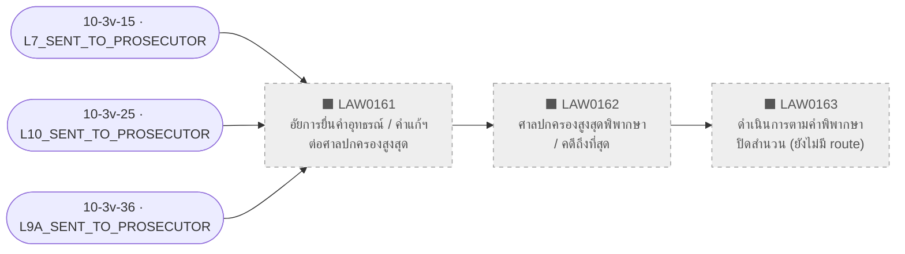

| # | Role | Page | Step | statusCode (from → to) | Inbox label (ก่อน → หลัง) | LAW index | Action (TH) | Next page / branch |
| --- | --- | --- | --- | --- | --- | --- | --- | --- |
| N10.a | สำนักงานคดีปกครอง (อัยการ) | ⬛ ไม่มีหน้าจอ | LAW0161 | `L7_SENT_TO_PROSECUTOR` / `L10_SENT_TO_PROSECUTOR` / `L9A_SENT_TO_PROSECUTOR` (ค้าง — ไม่มี route) | ก่อน: «ส่งคำแก้อุทธรณ์ไปสำนักงานคดีปกครองแล้ว» / «จัดส่งคำอุทธรณ์ไปยังสำนักงานคดีปกครองแล้ว (รอยื่นต่อศาลปกครองสูงสุด)» | LAW0161* | ยื่นคำอุทธรณ์ / คำแก้อุทธรณ์ต่อศาลปกครองสูงสุด | N10.b |
| N10.b | ศาลปกครองสูงสุด (ภายนอก) | ⬛ ไม่มีหน้าจอ | LAW0162 | — | — | LAW0162* | พิพากษา / คดีถึงที่สุด | N10.c |
| N10.c | นิติกร กลุ่มงานคดี | ⬛ ไม่มีหน้าจอ (มีหน้า LAW0163 เฉพาะ 10-3v-07 และ 10-3v-48 — สายนี้ยังไม่มี) | LAW0163 | — | — | LAW0163* | ดำเนินการตามคำพิพากษา ปิดสำนวน | 🏁 (ยังไม่สร้าง) |

---

## LAW code ที่ตัด / รวม / ภายนอก / ยังไม่สร้าง

| Part | ตัด (cut) | รวม (merged) | ภายนอก / ไม่มีหน้า | ยังไม่สร้าง |
| --- | --- | --- | --- | --- |
| 1 | LAW0091 | 0086 → 02 · 0092 → 10-3-04 · 0096 → 10-3-09 · 0087 ถือว่าครอบคลุมที่ 02 | LAW0084 (ศาลออกหมาย) | ขั้น "(เพิ่ม) ผอ.กลุ่มงาน เสนอ" |
| 1b / 3 | — | 0100 + 0101 → 10-3b-04 · 0102 = สาขายกคำขอ | ขั้นศาลก่อน LAW0100 | — |
| 4 | — | 0114 แยกเป็น 10-3-22 + 23 | — | ไม่มี L3-23 / 10-3-14 · ลำดับ 0104/0105 สลับ |
| 5 | — | 0120 → 10-3v-00 | LAW0116–0118 | หน้า 10-3v-01 (แผนเดิม) |
| 6 | — | 0124, 0125 → 10-3v-04 · 0128 → 10-3v-06 | — | — |
| 7 | loop มอบหมายซ้ำ | 0132 → 0131 · 0136, 0137 → 0133 · 0138 → 0134 | LAW0129–0130 | — |
| 8 | LAW0147 + มอบหมายรอบ 2 | 0144 → 0143 · 0148 → 0145 | LAW0142 | — |
| 9 | LAW0149 (ซ้ำกับ 10-3v-19) | — | มติบอร์ด (seed เท่านั้น) | — |
| 10 | LAW0156 ในสายหลัก (ซ้ำกับ 10-3v-19) | Branch A: 0153 + 0156 → 10-3v-32 | — | **LAW0161–0162** (อัยการ/ศาล) — ไม่มี route จาก `*_SENT_TO_PROSECUTOR` ไปปิด LAW0163 |
| 11 | LAW0165, 0166, (เพิ่ม) | 0164 + 0167 → 10-3v-40 · 0171 + 0163 → 10-3v-48 | — | — |

## Terminal statuses

`L3_AWAITING_JUDGMENT` · `L3B2_APPEAL_FILED` · `L3B2_CLOSED` · `L3V_CLOSED` · `L7_SENT_TO_PROSECUTOR` · `L9_PROPOSED_TO_BOARD` · `L10_SENT_TO_PROSECUTOR` · `L9A_SENT_TO_PROSECUTOR` · `L9B_CLOSED`

## ⚠ ข้อสังเกตที่พบ

1. **ไม่มีตีกลับ** ที่ 10-3-02, 03, 07, 08, 10-3-19 (ขณะที่ 10-3-18 มี), 10-3v-05, 06, 22, 26
2. **บทบาท Part 4 ต่างจาก AS-IS:** LAW0103 = ธุรการ (AS-IS นิติกร), LAW0111 = เลขาฯ/รองเลขาฯ, LAW0112 = สารบรรณกลาง, LAW0113 = ประธานฯ
3. **Part 4 → Part 5 ไม่ต่อกัน:** AS-IS LAW0115 → LAW0124 แต่ในโค้ด Part 5 เปิดเป็นเคสใหม่ (เชื่อมกลับได้ทาง `l3OriginCaseId` โดยไม่เปลี่ยนสถานะเคสเดิม)
4. **มติบอร์ด (Part 9 → A/B)** ไม่มีหน้าใดเขียน `L9_BOARD_APPROVED_*` — มีเฉพาะเคส seed (คดีปกครอง-100311/2569, -100312/2569)
5. **หน้า 19–22 (legacy) ไม่ถูกใช้ใน 10.3** — 10.3 route ผ่าน `Activity103.ROUTES` ก่อนถึง routing เดิม
6. **comment เก่าใน JS:** `ecmis-10-3.js` ~L1051 ("ไม่มี route" สำหรับ `L3_READY_FOR_BOARD`) และ ~L1117 (`L3V_TO_APPEAL_*` ยังไม่มี route) ล้าสมัย

## ความคลาดเคลื่อน checklist vs โค้ด ([task-10-3-checklist.md](../activity10/docs/10.3%20mockup/task-10-3-checklist.md))

| # | Checklist บอก | ความจริงในโค้ด |
| --- | --- | --- |
| 1 | LAW0099 / `10-3b-03` ยังไม่ implement, เคสลูกค้างที่ `L3B_PENDING_LAWYER_DISPATCH` | `10-3b-03` มีแล้ว เขียน `L3B_CLOSED` |
| 2 | Part 3 ยังไม่ implement | `10-3b-04` มีแล้ว (→ `L3B2_APPEAL_FILED` / `L3B2_CLOSED`) |
| 3 | สรุป: เหลือ Part 1b/2/3 | สร้างครบแล้วทั้งหมด |
| 4 | LAW0155 ยังไม่ implement | `10-3v-30` = LAW0155 |
| 5 | Row 10 ว่า Branch B ยังไม่สร้าง | สร้างแล้ว (ขัดกับ row 11 ของตัวเองด้วย) |
| 6 | Branch A = LAW0154–0160 | ครอบคลุม LAW0153 ด้วย (`10-3v-32`) |
| 7 | 3 ทางออก Part 6 เป็น black box | route ครบ (10-3v-08 / 16 / 07) |
| 8 | Row 8 ว่า Part 9 ยังไม่สร้าง | สร้างแล้ว (10-3v-26…28) |
| 9 | 10-3v-00 ยังไม่มีหน้าถัดไป | `10-3v-02` มีแล้ว |
| 10 | `L3_READY_FOR_BOARD` ไม่มีหน้าถัดไป | route ไป 10-3-10 |
| 11 | Part 2–11 ไม่มีหน้า | ล้าสมัย |
| 12 | ตาราง roles มีแค่ 4 บทบาท | ขาด `chairman`, `secgen`, `deputy_sg`, `registry` |
| 13 | ข้อทดสอบ 1b ยังพูดถึง TipTap ใน 10-3b-01 | ขัดกับ row 1b ("ไม่ใช้ live editor แล้ว") |

**เอกสาร/คอมเมนต์อื่นที่ล้าสมัย:** `test-flow.md` บรรทัด 33, 45 · `implementation-plan-part1.md` (ว่าเขียน `L3_PENDING_ADMIN_RECEIVE`) · `implementation-plan-part5-6.md` (แผนหน้า 10-3v-01)
